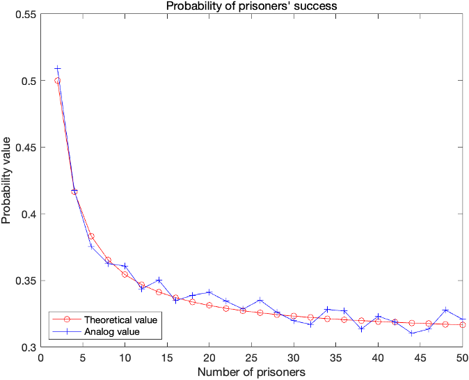




The 100 prisoners problem is a counterintuitive problem. It describes a seemingly impossible event: 100 prisoners have a chance to do the same thing, and only when all the prisoners do it can they survive. In fact, there is a reasonable implementation method for this problem to increase its probability by nearly **30 orders of magnitude**.


## Introduction

The 100 prisoners problem is a mathematical problem in probability theory and combinatorics. In this problem, 100 numbered prisoners must find their own numbers in one of 100 drawers in order to survive. The rules state that each prisoner may open only 50 drawers and cannot communicate with other prisoners. Danish computer scientist ***Peter Bro Miltersen*** first proposed the problem in 2003. As an upgraded version of this problem, there will be \\(2N\\) prisoners. Their corresponding \\(2N\\) number cards are shuffled and placed in \\(2N\\) drawers. Each prisoner must open at most half of all the drawers and find the corresponding number card for his own number. All prisoners will enter the room separately. The failure of any one prisoner will result in the failure of the entire challenge. What is the maximum probability that the prisoners winning?

## Theoretical Analysis

### Open the drawer randomly

Suppose All Prisoners Randomly Open \\(50\\) drawers In \\(100\\) Boxes.

Set a random variable \\(X_i\\) as follows.

$$
X_i=\begin{cases}
1\quad \text{There is number i note in 50 drawers.}\cr
0\quad \text{There is no number i note in 50 drawers.}
\end{cases}
$$

Because the drawer where the note with its own number is uniformly distributed, the probability of pulling the box with its own numbered note is \\(P(X_i=1)=\frac{50}{100}=\frac{1}{2}\\) .

And because the incidents in which all prisoners open the drawer are independent, the probability that all prisoners will get a note with their own number can be calculated as follows.

$$
\begin{aligned}
P(X_1=1,X_2=1,\cdots,X_{100}=1)=&P(X_1=1) \cdots P(X_{100}=1)\cr
=&0.5^{100}\cr
\approx &7.89 \times 10^{-31}
\end{aligned}
$$

This probability is obviously too low, even lower than selecting a lucky man out of \\(10^{30}\\) prisoners.

### Open the drawer in a way

**Theorem 1: If the number of a box is treated as a value and the number of a note is treated as a pointer, then there are and only are several cycles in the room.**

<details>
<summary>Proof</summary>
Because the numbers of the boxes and notes range from 1 to 100, each box has and only has one slip corresponding to its number and each slip is placed in a box, there are no slips without boxes or boxes without slips, that is, there are only cycles in the room.
</details>

**Theorem 2: If there is no limit on the number of steps, each person can find the note with their own number by the above method, that is, the note with their own number must be in the cycle they walk.**

<details>
<summary>Proof</summary>
From Theorem 1, since they start with the box with their own number, there must be a note with their own number pointing to the box with their own number in this cycle, that is, the note with their own number can be found if there is no limit on the number of steps.
</details>

Now we can transform the problem into given that the prisoners act according to the above method, find the probability \\(P\\) that all prisoners succuss. From Theorem 2, we can further abstract the problem as: find the probability \\(P\\) that the length of all cycles in the \\(100\\) nodes with randomly assigned numbers from \\(1\\) to \\(100\\) is not more than \\(50\\).

### General problem

Through the theoretical analysis of the special problem, that is, the problem of \\(100\\) prisoners, we further analyze the general solution to the problem, that is, the best strategy for \\(2N\\) prisoners.

When there are \\(2N\\) prisoners, through **Open the drawer in a way** analysis, we can give the following optimal strategy. \\(2N\\) prisoners label \\(2N\\) drawers with random numbers. When each prisoner enters the room, they choose the drawer with the same number as their label, take out the note, and continue opening the drawer with the same number as the note, and so on.

If the number on the slip in drawer \\(k\\) is \\(s\\), then this strategy can be represented as \\(f(s)=k\\) , where \\(f\\) is a map from the drawer number to the number number, that is, from the current drawer to the next drawer. And this map has the following properties:

$$
\exists i, 1 \leq i \leq 2N, \underbrace{f \circ \cdots \circ f}_{i \text{ times}}(s) = s
$$

Currently, the condition for the prisoner's success is:

$$
\forall s, 1 \leq s \leq 2N, \exists i, 1 \leq i \leq N, \underbrace{f \circ \cdots \circ f}_{i \text{ times}}(s) = s
$$

For any number, it can be mapped up to itself by applying the function \\(i\\) times.

Therefore, the sample space for this strategy is the set of all possible mappings. There are \\(2N!\\) possible permutations. If it takes at least \\(m\\) times mapping for a certain number to map back to itself, then the number of situations we have is as follows.

$$ C_{2N}^m \cdot (m-1)! \cdot (2N-m)! = \frac{(2N)!}{m} $$

The probability that a number can return to itself after at least m mapping is

$$ P(m) = \frac{\frac{(2N)!}{m}}{(2N)!} = \frac{1}{m} $$

When \\(m \ge N+1\\) , various situations are mutually exclusive, so the probability of prisoners' success is as follows.

$$ P = 1 - \sum_{m=N+1}^{2N} \frac{1}{m} $$

## Application and Experiments

### Verify the 100 prisoners problem

According to the theoretical analysis in **Open the drawer in a way**, we can further deduce. If there is a cycle with length greater than \\(50\\), then the number of such cycles must be \\(1\\), so we consider the probability \\(P'\\) of the existence of a cycle with length greater than \\(50\\). Obviously, the two events are complementary, so \\(P = 1 - P'\\).

First, consider a cycle with length \\(100\\). If the cycle is broken at any point, there are \\(A_{100}^{100}=100!\\) ways. Then, if the cycle is reconnected, any point on the cycle can be considered as the starting point, that is, rotating the cycle is considered the same case, so the actual number of cases is \\(\frac{100!}{100}\\) . The total number of cases for randomly placing \\(100\\) notes in \\(100\\) drawers is  \\(A_{100}^{100}={100!}\\) . Therefore, the probability of there being a cycle with length \\(100\\) is:

$$ P_{100}=\frac{\frac{100!}{100}}{100} = \frac{1}{100} $$

Similarly, consider a cycle with length \\(k (k > 50)\\) . First, select \\(k\\) elements as the elements of the cycle, a total of \\(C_{100}^k\\) ways; shuffle them on the cycle, a total of \\(\frac{k!}{k}\\) ; the remaining \\(100-k\\) elements are randomly assigned, a total of \\((100-k)!\\) cases; therefore, the number of cases with a cycle of length \\(k\\) is:

$$ C_{100}^k \cdot \frac{k!}{k} \cdot (100-k)! = \frac{100!}{k} $$

Therefore, the probability of there being a cycle of length \\(k\\) is:

$$ P_k=\frac{\frac{100!}{k}}{100!}=\frac{1}{k} $$

Since the cases of the existence of a cycle with length \\(k (k > 50)\\) are independent of each other, \\(P'=\sum_{i=51}^{100} P_i\\) , and using a computer program, \\(P' \approx 0.688\\) can be obtained.

The C language code is as follows.
```c
#include <stdio.h>
int main() {
    double sum = 0;
    for (int i = 51; i <= 100; i++) {
            sum = sum + 1.0 / i;
    }
    printf("sum=%lf\n", sum);
    return 0;
}
```

The results are as follows:
```shell
gcc sum_p.c - o sum_p &&./ sum_p
sum = 0.0688172
```

Therefore, \\(P=1-P'\approx 0.312\\), this method is obviously more feasible than the probability of \\(7.89 \times 10^{-31}\\) in **randomly open the drawer**.

### Verify general problem

Verify the calculation results using **MATLAB** simulation. When the number of prisoners is \\(2-50\\), for each case, simulate \\(10000\\) times and count the frequency of prisoner release to obtain the curve in Figure.



The red curve is drawn according to \\(P=1-\sum_{m=N+1}^{2N} \frac{1}{m}\\) from **General problem**, and the blue curve is obtained by simulation. The results obtained from the simulation are roughly the same as the theoretical calculation value, which verifies the correctness of the theoretical calculation.

The MATLAB code is as follows.
```matlab
loop_times = 10000;
theo_prob = [];
simu_prob = [];

for i = 2:2:50
    total = 0;

    for k = i / 2 + 1:1:i
        total = total + 1 / k;
    end

    theo_prob = [theo_prob, 1 - total];
    not_release = 0;

    for j = 1:1:loop_times
        draw = rand([i, 1]);
        [temp, draw] = sort(draw);
        flag = 0;

        for n = 1:1:i
            index = n;

            for m = 1:1:i
                index = draw(index);

                if (index == n) && (m <= i / 2)
                    break
                elseif (index == n) && (m >= i / 2 + 1)
                    flag = 1;
                    n = i + 1;
                    break
                end

            end

        end

        not_release = not_release + flag;
    end

    simu_prob = [simu_prob, 1 - not_release / loop_times];
    i;
end

x = 2:2:50;
plot(x, theo_prob, 'ro-')
hold on;
plot(x, simu_prob, 'b+-')
legend({'Theoretical value', 'Analog value'}, 'Location', 'southwest')
title("Probability of prisoners' success")
xlabel("Number of prisoners")
ylabel("Probability value")
```

Scaling the formula \\(P=1-\sum_{m=N+1}^{2N}\frac{1}{m}\\) gives the following result.

$$ P > 1-\int_{N+1}^{2N} \frac{1}{dx} = 1-\ln 2 \approx 0.307 $$

It follows that this probability has a lower bound of \\(1-\ln2\\).

## Conclusion

According to the above calculation results, we know that even if there are more prisoners, all prisoners still have a probability of nearly one third of success - this is contrary to our intuition, at the beginning, our intuition told us that it is almost impossible to let \\(100\\) prisoners find their own numbers. The key point of this strategy is that it combines the results of all people together, trying to succeed or fail together as much as possible. In the end, there are only two possibilities: there is a cycle with length greater than \\(50\\) or there is not. Therefore, there are only two results: complete victory or complete defeat - there is no result where only a few people fail.


Rely on rigorous calculations, not intuition, to solve problems accurately.
