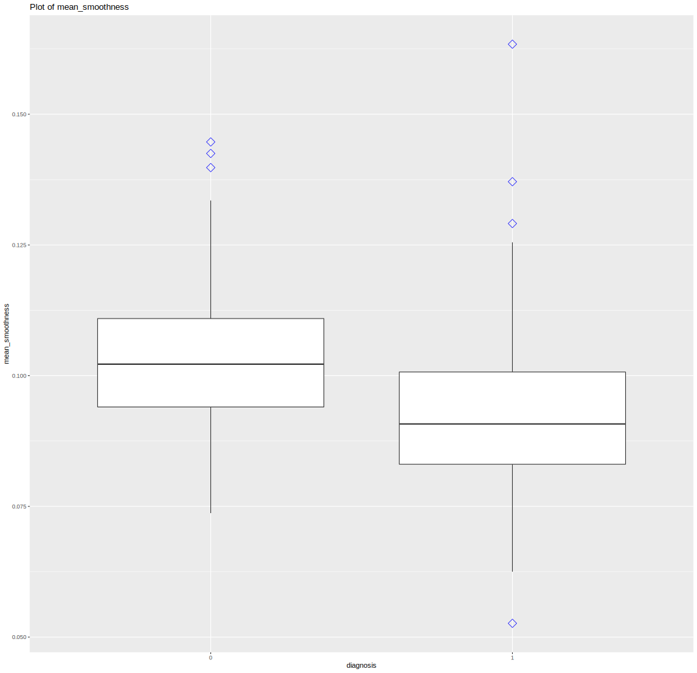

> Data source: [Breast Cancer Prediction Dataset](https://www.kaggle.com/datasets/merishnasuwal/breast-cancer-prediction-dataset)

## Introduction

Worldwide, breast cancer is the most common type of cancer in women and the second highest in terms of mortality rates.Diagnosis of breast cancer is performed when an abnormal lump is found (from self-examination or x-ray) or a tiny speck of calcium is seen (on an x-ray). After a suspicious lump is found, the doctor will conduct a diagnosis to determine whether it is cancerous and, if so, whether it has spread to other parts of the body. 

This breast cancer dataset was obtained from the University of Wisconsin Hospitals, Madison from Dr. William H. Wolberg.

## Import

The first step is import the raw data to the program code.

```R
data <- read.csv("Breast_cancer_data.csv")
```

Thanks to the selected raw data containing the header and the built-in function(`read.csv`) of importing *CSV files* in the R language, we only need a simple line of code to efficiently import files into our program for subsequent processing.

Using the `head` function, we briefly view part of the data.

```R
head(data)
```

```text
#   mean_radius mean_texture mean_perimeter mean_area mean_smoothness diagnosis
# 1       17.99        10.38         122.80    1001.0         0.11840         0
# 2       20.57        17.77         132.90    1326.0         0.08474         0
# 3       19.69        21.25         130.00    1203.0         0.10960         0
# 4       11.42        20.38          77.58     386.1         0.14250         0
# 5       20.29        14.34         135.10    1297.0         0.10030         0
# 6       12.45        15.70          82.57     477.1         0.12780         0
```

Obviously, each piece of data in the dataset contains 5 data related to breast cancer, and 0 and 1 are used in the last column to indicate whether the diagnosis is confirmed.

## Tidy

Generally speaking, in order to analyze the data, we need to **clean the data** to a certain extent, separate and merge some cell data, discard some unwanted data, and amplify important data, so as to make the data more **compact** for us to modeling and analyze.

We expect to use data to build models. For this data set, every piece of information has its utilization value, so in order to ensure that the amount of data is sufficient, we do not need to process it too much.

### Check for missing data

We need to judge whether there is any data missing data in the data set to avoid unforeseen errors when building the model.

```R
sum(is.na(data))
```

Fortunately, there is no data missing in our dataset, and each piece of data is complete and full of utilization value.

### View redundant data

First of all, we need to ensure that the data in the dataset is not duplicated to prevent interference with subsequent modeling.

```R
duplicated_count <- sum(duplicated(data))
```

Output 0, no duplicate data.

## Analyze data

Our goal is to establish a reasonable prediction model to achieve accurate prediction of breast cancer diagnosis through certain quantifiable data.

### Analyze the distribution of variables

In order to have a basic understanding of the distribution of parameters, we will map the distribution of each variable separately.

In this case, the combination of histogram and density distribution map is the most intuitive and effective.

Since the longitudinal axis of  `geom_density()` is density estimation, in order to be able to draw the histogram and the density estimation in the same coordinate system, it is necessary to change the longitudinal axis of the histogram to density estimation.

```R
rel_area <- ggplot(data, aes(x = mean_area, y = ..density..)) +
  geom_histogram(fill = "blue", color = "black", size = 0.2, alpha = 0.2, bins = 30) +
  geom_density()
rel_radius <- ggplot(data, aes(x = mean_radius, y = ..density..)) +
  geom_histogram(fill = "blue", color = "black", size = 0.2, alpha = 0.2, bins = 30) +
  geom_density()
rel_texture <- ggplot(data, aes(x = mean_texture, y = ..density..)) +
  geom_histogram(fill = "blue", color = "black", size = 0.2, alpha = 0.2, bins = 30) +
  geom_density()
rel_smooth <- ggplot(data, aes(x = mean_smoothness, y = ..density..)) +
  geom_histogram(fill = "blue", color = "black", size = 0.2, alpha = 0.2, bins = 30) +
  geom_density()
rel_perimeter <- ggplot(data, aes(x = mean_perimeter, y = ..density..)) +
  geom_histogram(fill = "blue", color = "black", size = 0.2, alpha = 0.2, bins = 30) +
  geom_density()
```

Finally, we use the `grid.arrange` function in the `gridExtra` library to arrange the charts together.

```R
grid.arrange(rel_area, rel_radius, rel_texture, rel_smooth, rel_perimeter,
  nrow = 3,
  ncol = 2
)
```


We note that the distribution of all data has two properties:

1. All data is continuously distributed in a certain interval.
2. Each data is distributed in large quantities near a value, and the farther away it is, the less distributed it will be.

### Analysis of univariate diagnostic results

> We analyze the correlation between each variable and the diagnostic results. Here we use the method of drawing a box pattern.

#### mean_radius

```R
ggplot(data, aes(x = factor(diagnosis), y = mean_radius)) +
  geom_boxplot(outlier.colour = "blue", outlier.shape = 5, outlier.size = 4) +
  labs(title = "Plot of mean_radius", x = "diagnosis")
```


It can be seen that the average tumor radius of patients with breast cancer is mainly between 10 and 15, while the undiagnosed is mainly between 15 and 20.

#### mean_texture

```R
ggplot(data, aes(x = factor(diagnosis), y = mean_texture)) +
  geom_boxplot(outlier.colour = "blue", outlier.shape = 5, outlier.size = 4) +
  labs(title = "Plot of mean_texture", x = "diagnosis")
```


It can be found that the average texture value of the patient's tumor is between 15 and 20, while that has not been diagnosed is between 20 and 25.

#### mean_perimeter

```R
ggplot(data, aes(x = factor(diagnosis), y = mean_perimeter)) +
  geom_boxplot(outlier.colour = "blue", outlier.shape = 5, outlier.size = 4) +
  labs(title = "Plot of mean_perimeter", x = "diagnosis")
```


As can be seen from the figure, the average perimeter of tumors in confirmed patients is between 70 and 90, while those that have not been diagnosed is between 100 and 130.

#### mean_area

```R
ggplot(data, aes(x = factor(diagnosis), y = mean_area)) +
  geom_boxplot(outlier.colour = "blue", outlier.shape = 5, outlier.size = 4) +
  labs(title = "Plot of mean_area", x = "diagnosis")
```


It can be found that the average tumor area of confirmed patients is about 500, while the main undiagnosed tumors are between 750 and 1250.

#### mean_smoothness

```R
ggplot(data, aes(x = factor(diagnosis), y = mean_smoothness)) +
  geom_boxplot(outlier.colour = "blue", outlier.shape = 5, outlier.size = 4) +
  labs(title = "Plot of mean_smoothness", x = "diagnosis")
```



We have noticed that there is an intersection of tumor smoothness in patients with positive or negative confirmed results, but in general, the value of confirmed patients will be lower.

### Relevance analysis

According to the general process of modeling, we need to carry out correlation analysis of each variable.

If the correlation between variables is significant, it will affect the predictive effect of the model.

```R
cor_analysis <- cor(data[c(1:5)])
corrplot(cor_analysis, method = "number")
```


Through correlation analysis, we found that the relationship between the three variables is very significant.

They are **radius**, **perimeter** and **area**.

These three values are obviously highly correlated, so we need to filter them.

### Correlation between variables and diagnostic results

Before the final accuracy of the qualitative analysis model, we want to use the image to see the relationship between variables and diagnostic results first. There are some intuitive impressions.

We have a total of five variables:

1. mean_radius
2. mean_texture
3. mean_perimeter
4. mean_area
5. mean_smoothness

The correlation between them and diagnostic results is combined, and there are a total of 10 situations that need to be discussed and analyzed.

> The red dot in the chart below indicates that the diagnostic result is undiagnosed.

#### Weak correlation of variables

> radius & texture, radius & smoothness, texture & perimeter, texture & area, texture & smoothness, perimeter & smoothness, area & smoothness


We can have an intuitive understanding of the relationship between the two variables through the scatter distribution in the chart.

#### Strong correlation of variables

> radius & perimeter, radius & area, perimeter & area

```R
# radius & perimeter
rpPlot <- ggplot(data, aes(
  x = mean_radius, y = mean_perimeter,
  color = as.factor(diagnosis)
)) +
  geom_point() +
  theme_minimal() +
  theme(legend.position = "none")
# radius & area
raPlot <- ggplot(data, aes(
  x = mean_radius, y = mean_area,
  color = as.factor(diagnosis)
)) +
  geom_point() +
  theme_minimal() +
  theme(legend.position = "none")
# perimeter & area
paPlot <- ggplot(data, aes(
  x = mean_perimeter, y = mean_area,
  color = as.factor(diagnosis)
)) +
  geom_point() +
  theme_minimal() +
  theme(legend.position = "none")
grid.arrange(rpPlot, raPlot, paPlot,
  nrow = 1,
  ncol = 3
)
```


As previously expected, they are quite relevant, and their analysis can be carried out at the same time.

Obviously, from the chart, patients with an average tumor radius of 10 to 15 have a higher probability of being diagnosed with breast cancer.

## Model

### Dataset segmentation

For subsequent modeling, we need to randomly divide the data set into two parts, one to train the prediction model, and the other to test the accuracy of the model.

```R
set.seed(123) # Set the repeatability set.seed() to ensure that it is repeatable
train <- sample(nrow(data), 0.7 * nrow(data))
train_data <- data[train, ]
test_data <- data[-train, ]
```

*train_ data* means training data, *validate_ data* stands for inspection data

### Logistic regression modeling

> Since the final prediction results are 0 and 1, it is not suitable to use linear regression.
>
> Here we choose to use the idea of logical regression to build a model.

The connection function used in logical regression is the best representative of the Sigmoid function, that is, the logistic function.

From the above analysis, we select *radius* among *radius*, *perimeter* and *area* for modeling.

```R
model <- glm(
  data = train_data,
  formula = diagnosis ~ mean_texture + mean_smoothness + mean_radius,
  family = binomial(link = "logit")
)
model <- step(model) # Carry out the step-by-step regression method for data analysis
summary(model)
```

Use `summary (model)` to view the model.

```text
Call:
glm(formula = diagnosis ~ mean_texture + mean_smoothness + mean_radius,
    family = binomial(link = "logit"), data = train_data)

Deviance Residuals:
     Min        1Q    Median        3Q       Max
-2.91948  -0.03436   0.04781   0.21133   2.01672

Coefficients:
                  Estimate Std. Error z value Pr(>|z|)
(Intercept)       40.52957    5.09828   7.950 1.87e-15 ***
mean_texture      -0.34187    0.06622  -5.163 2.44e-07 ***
mean_smoothness -140.35265   21.54005  -6.516 7.23e-11 ***
mean_radius       -1.36821    0.17827  -7.675 1.65e-14 ***
---
Signif. codes:  0 ‘***’ 0.001 ‘**’ 0.01 ‘*’ 0.05 ‘.’ 0.1 ‘ ’ 1

(Dispersion parameter for binomial family taken to be 1)

    Null deviance: 515.0  on 397  degrees of freedom
Residual deviance: 134.9  on 394  degrees of freedom
AIC: 142.9

Number of Fisher Scoring iterations: 8
```

From the results of `summary`, it can be seen that the three variables we selected contribute significantly to the results.

### Calculate the fitting threshold

Here we use `roc` from `pRoc` to find the optimal threshold.

```R
pre <- predict(model, type = "response", train_data)
modelroc <- roc(train_data$diagnosis, pre)
plot(modelroc,
  print.auc = TRUE, auc.polygon = TRUE,
  grid = c(0.1, 0.2), grid.col = c("green", "red"),
  max.auc.polygon = TRUE,
  auc.polygon.col = "skyblue", print.thres = TRUE
)
```


It can be seen that 0.588 is the threshold we need. Considering it, we choose 0.6 as the threshold of the model.

### Test Set Data Validation

After successfully using the training set data to build a model, we should also use the check data set to check the accuracy of model prediction.

Since the forecast is a number, and what we ultimately want is a confirmed or undiagnosed result, we need a threshold to classify the predicted value to get a numerical result of 1 or 0.

```R
test_data$prob <- model %>%
  predict(type = "response", newdata = test_data)
test_data$prob <- ifelse(test_data$prob > 0.6, 1, 0)
test_data$diff <- ifelse(test_data$diagnosis == test_data$prob, 1, 0)
```

### Evaluate the predictive effect of the model

We can draw a pie chart to visualize the accuracy of the model.

```R
diff_count <- test_data %>%
  count(diff, name = "count")
diff_count$diff <- ifelse(diff_count$diff == 0, "False", "True")

diff_plot <- diff_count %>%
  ggplot(mapping = aes(
    x = 1,
    y = count,
    fill = factor(diff),
  ))

diff_plot +
  geom_bar(stat = "identity") +
  coord_polar(theta = "y") +
  scale_x_continuous(name = NULL, breaks = NULL) +
  scale_y_continuous(name = NULL, breaks = NULL) +
  labs(
    x = "", y = "",
    fill = "",
    title = "Model prediction accuracy",
  ) +
  theme(
    legend.position = "top",
    plot.title = element_text(hjust = 0.5, size = 14), # title position
  )
```


```R
paste(
  round(100 * diff_count$count[2] / (diff_count$count[1] + diff_count$count[2]), 2),
  "%"
)
```

```text
[1] "93.57 %"
```

The result was very surprising. The prediction accuracy of our model was extremely high. In order to avoid errors and remove preset random values, I tried many times and got better results of more than 90%, which shows that our model is stable and accurate.

{}
```R
library(tidyverse)
library(ggplot2)
library(corrplot)
library(pROC)
library(gridExtra)

# Import the original data
data <- read.csv("Breast_cancer_data.csv")
head(data)

# Check for missing data
sum(is.na(data))

# Redundant data view
duplicated_count <- sum(duplicated(data))

# Analyze the distribution of each variable
rel_area <- ggplot(data, aes(x = mean_area, y = ..density..)) +
  geom_histogram(fill = "blue", color = "black", size = 0.2, alpha = 0.2, bins = 30) + # nolint
  geom_density()
rel_radius <- ggplot(data, aes(x = mean_radius, y = ..density..)) +
  geom_histogram(fill = "blue", color = "black", size = 0.2, alpha = 0.2, bins = 30) + # nolint
  geom_density()
rel_texture <- ggplot(data, aes(x = mean_texture, y = ..density..)) +
  geom_histogram(fill = "blue", color = "black", size = 0.2, alpha = 0.2, bins = 30) + # nolint
  geom_density()
rel_smooth <- ggplot(data, aes(x = mean_smoothness, y = ..density..)) +
  geom_histogram(fill = "blue", color = "black", size = 0.2, alpha = 0.2, bins = 30) + # nolint
  geom_density()
rel_perimeter <- ggplot(data, aes(x = mean_perimeter, y = ..density..)) +
  geom_histogram(fill = "blue", color = "black", size = 0.2, alpha = 0.2, bins = 30) + # nolint
  geom_density()
grid.arrange(rel_area, rel_radius, rel_texture, rel_smooth, rel_perimeter,
  nrow = 3,
  ncol = 2
)

# Univariate box pattern analysis
# mean_radius
ggplot(data, aes(x = factor(diagnosis), y = mean_radius)) +
  geom_boxplot(outlier.colour = "blue", outlier.shape = 5, outlier.size = 4) +
  labs(title = "Plot of mean_radius", x = "diagnosis")
# mean_texture
ggplot(data, aes(x = factor(diagnosis), y = mean_texture)) +
  geom_boxplot(outlier.colour = "blue", outlier.shape = 5, outlier.size = 4) +
  labs(title = "Plot of mean_texture", x = "diagnosis")
# mean_perimeter
ggplot(data, aes(x = factor(diagnosis), y = mean_perimeter)) +
  geom_boxplot(outlier.colour = "blue", outlier.shape = 5, outlier.size = 4) +
  labs(title = "Plot of mean_perimeter", x = "diagnosis")
# mean_area
ggplot(data, aes(x = factor(diagnosis), y = mean_area)) +
  geom_boxplot(outlier.colour = "blue", outlier.shape = 5, outlier.size = 4) +
  labs(title = "Plot of mean_area", x = "diagnosis")
# mean_smoothness
ggplot(data, aes(x = factor(diagnosis), y = mean_smoothness)) +
  geom_boxplot(outlier.colour = "blue", outlier.shape = 5, outlier.size = 4) +
  labs(title = "Plot of mean_smoothness", x = "diagnosis")

# Correlation analysis between variables
cor_analysis <- cor(data[c(1:5)])
corrplot(cor_analysis, method = "number")

# Relevance between variables and results
# ----------------------------Related variables------------------------------ #
# radius & texture
rtPlot <- ggplot(data, aes(
  x = mean_radius, y = mean_texture,
  color = as.factor(diagnosis)
)) +
  geom_point() +
  theme_minimal() +
  theme(legend.position = "none")
# radius & smoothness
rsPlot <- ggplot(data, aes(
  x = mean_radius, y = mean_smoothness,
  color = as.factor(diagnosis)
)) +
  geom_point() +
  theme_minimal() +
  theme(legend.position = "none")
# texture & perimeter
tpPlot <- ggplot(data, aes(
  x = mean_texture, y = mean_perimeter,
  color = as.factor(diagnosis)
)) +
  geom_point() +
  theme_minimal() +
  theme(legend.position = "none")
# texture & area
taPlot <- ggplot(data, aes(
  x = mean_texture, y = mean_area,
  color = as.factor(diagnosis)
)) +
  geom_point() +
  theme_minimal() +
  theme(legend.position = "none")
# texture & smoothness
tsPlot <- ggplot(data, aes(
  x = mean_texture, y = mean_smoothness,
  color = as.factor(diagnosis)
)) +
  geom_point() +
  theme_minimal() +
  theme(legend.position = "none")
# perimeter & smoothness
psPlot <- ggplot(data, aes(
  x = mean_perimeter, y = mean_smoothness,
  color = as.factor(diagnosis)
)) +
  geom_point() +
  theme_minimal() +
  theme(legend.position = "none")
# area & smoothness
asPlot <- ggplot(data, aes(
  x = mean_area, y = mean_smoothness,
  color = as.factor(diagnosis)
)) +
  geom_point() +
  theme_minimal() +
  theme(legend.position = "none")
grid.arrange(rtPlot, rsPlot, tpPlot, taPlot, tsPlot, psPlot, asPlot,
  nrow = 3,
  ncol = 3
)
# ---------------------------Strong related variable---------------------------- #
# radius & perimeter
rpPlot <- ggplot(data, aes(
  x = mean_radius, y = mean_perimeter,
  color = as.factor(diagnosis)
)) +
  geom_point() +
  theme_minimal() +
  theme(legend.position = "none")
# radius & area
raPlot <- ggplot(data, aes(
  x = mean_radius, y = mean_area,
  color = as.factor(diagnosis)
)) +
  geom_point() +
  theme_minimal() +
  theme(legend.position = "none")
# perimeter & area
paPlot <- ggplot(data, aes(
  x = mean_perimeter, y = mean_area,
  color = as.factor(diagnosis)
)) +
  geom_point() +
  theme_minimal() +
  theme(legend.position = "none")
grid.arrange(rpPlot, raPlot, paPlot,
  nrow = 1,
  ncol = 3
)

# Dataset segmentation
set.seed(123) # Set the repeatable set.seed() to ensure that it is repeatable
train <- sample(nrow(data), 0.7 * nrow(data))
train_data <- data[train, ]
test_data <- data[-train, ]

# Logical regression modeling
model <- glm(
  data = train_data,
  formula = diagnosis ~ mean_texture + mean_smoothness + mean_radius,
  family = binomial(link = "logit")
)
model <- step(model) # step-by-step regression method
summary(model) # Export all results

# Calculate the fitting threshold
pre <- predict(model, type = "response", train_data)
modelroc <- roc(train_data$diagnosis, pre)
plot(modelroc,
  print.auc = TRUE, auc.polygon = TRUE,
  grid = c(0.1, 0.2), grid.col = c("green", "red"),
  max.auc.polygon = TRUE,
  auc.polygon.col = "skyblue", print.thres = TRUE
)

# Test set data verification
test_data$prob <- model %>%
  predict(type = "response", newdata = test_data)
test_data$prob <- ifelse(test_data$prob > 0.6, 1, 0)
test_data$diff <- ifelse(test_data$diagnosis == test_data$prob, 1, 0)

# Test set data forecast statistics percentage
diff_count <- test_data %>%
  count(diff, name = "count")
diff_count$diff <- ifelse(diff_count$diff == 0, "False", "True")

diff_plot <- diff_count %>%
  ggplot(mapping = aes(
    x = 1,
    y = count,
    fill = factor(diff),
  ))

diff_plot +
  geom_bar(stat = "identity") +
  coord_polar(theta = "y") +
  scale_x_continuous(name = NULL, breaks = NULL) +
  scale_y_continuous(name = NULL, breaks = NULL) +
  labs(
    x = "", y = "",
    fill = "",
    title = "Model prediction accuracy",
  ) +
  theme(
    legend.position = "top",
    plot.title = element_text(hjust = 0.5, size = 14),
  )

paste(
  round(100 * diff_count$count[2] / (diff_count$count[1] + diff_count$count[2]), 2),
  "%"
)
```
{}