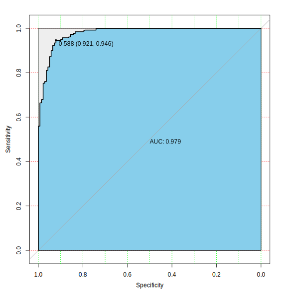

> 数据来源：[乳腺癌预测数据集](https://www.kaggle.com/datasets/merishnasuwal/breast-cancer-prediction-dataset)

## 简介

全球范围内，乳腺癌是女性最常见的癌症类型，在死亡率方面排名第二。当发现异常肿块（来自自我检查或X光）或看到钙质小点（在X光片上）时，就会进行乳腺癌的诊断。在发现可疑肿块后，医生将进行诊断以确定是否为癌症，如果是，是否已扩散到身体的其他部位。

此乳腺癌数据集是从威斯康星大学麦迪逊分校的威廉·H·沃尔伯格博士处获得的。

## 导入

第一步是将原始数据导入程序代码。

```R
data <- read.csv("Breast_cancer_data.csv")
```

原始数据包含标题，使用R语言中导入*CSV文件*的内置函数(`read.csv`)，只需一行简单的代码即可高效地将文件导入我们的程序进行后续处理。

使用`head`函数，我们可以简要查看数据的一部分。

```R
head(data)
```

```text
#   mean_radius mean_texture mean_perimeter mean_area mean_smoothness diagnosis
# 1       17.99        10.38         122.80    1001.0         0.11840         0
# 2       20.57        17.77         132.90    1326.0         0.08474         0
# 3       19.69        21.25         130.00    1203.0         0.10960         0
# 4       11.42        20.38          77.58     386.1         0.14250         0
# 5       20.29        14.34         135.10    1297.0         0.10030         0
# 6       12.45        15.70          82.57     477.1         0.12780         0
```

显然，数据集中每条数据包含5个与乳腺癌相关的数据，最后列使用0和1来表示是否确诊。

## 清洗数据

一般来说，为了分析数据，我们需要在一定程度上**清洗数据**，分离和合并一些单元格数据，丢弃一些不需要的数据，并放大重要数据，以便使数据对我们建模和分析更加**紧凑**。

我们期望使用数据来构建模型。对这个数据集，每条信息都有其利用价值，因此为了确保数据量充足，我们不需要对其进行过多处理。

### 检查缺失数据

我们需要判断数据集中是否存在缺失数据，以避免在构建模型时出现未预见的错误。

```R
sum(is.na(data))
```

幸运的是，我们的数据集中没有缺失数据，每一份数据都是完整且充满利用价值的。

### 查看冗余数据

首先，我们需要确保数据集中的数据没有重复，以防止对后续建模造成干扰。

```R
duplicated_count <- sum(duplicated(data))
```

输出 0，无重复数据。

## 分析数据

我们的目标是建立一个合理的预测模型，通过某些可量化数据实现乳腺癌诊断的准确预测。

### 分析变量分布

为了对参数分布有一个基本了解，我们将分别映射每个变量的分布。在这种情况下，直方图和密度分布图的组合是最直观和有效的。由于`geom_density()`的纵向轴是密度估计，为了能够在同一坐标系中绘制直方图和密度估计，有必要将直方图的纵向轴改为密度估计。

```R
rel_area <- ggplot(data, aes(x = mean_area, y = ..density..)) +
  geom_histogram(fill = "blue", color = "black", size = 0.2, alpha = 0.2, bins = 30) +
  geom_density()
rel_radius <- ggplot(data, aes(x = mean_radius, y = ..density..)) +
  geom_histogram(fill = "blue", color = "black", size = 0.2, alpha = 0.2, bins = 30) +
  geom_density()
rel_texture <- ggplot(data, aes(x = mean_texture, y = ..density..)) +
  geom_histogram(fill = "blue", color = "black", size = 0.2, alpha = 0.2, bins = 30) +
  geom_density()
rel_smooth <- ggplot(data, aes(x = mean_smoothness, y = ..density..)) +
  geom_histogram(fill = "blue", color = "black", size = 0.2, alpha = 0.2, bins = 30) +
  geom_density()
rel_perimeter <- ggplot(data, aes(x = mean_perimeter, y = ..density..)) +
  geom_histogram(fill = "blue", color = "black", size = 0.2, alpha = 0.2, bins = 30) +
  geom_density()
```

最后，我们使用`gridExtra`库中的`grid.arrange`函数将图表排列在一起。

```R
grid.arrange(rel_area, rel_radius, rel_texture, rel_smooth, rel_perimeter,
  nrow = 3,
  ncol = 2
)
```


我们注意到所有数据的分布有两个特性：

1. 所有数据在某个区间内连续分布。
2. 每个数据在某个值附近大量分布，距离越远，分布越少。

### 单变量诊断结果分析

> 分析每个变量与诊断结果之间的相关性，使用绘制箱形图的方法

#### 平均半径

```R
ggplot(data, aes(x = factor(diagnosis), y = mean_radius)) +
  geom_boxplot(outlier.colour = "blue", outlier.shape = 5, outlier.size = 4) +
  labs(title = "Plot of mean_radius", x = "diagnosis")
```


乳腺癌患者的平均肿瘤半径主要在10至15之间，而未诊断的患者主要在15至20之间。

#### 平均纹理

```R
ggplot(data, aes(x = factor(diagnosis), y = mean_texture)) +
  geom_boxplot(outlier.colour = "blue", outlier.shape = 5, outlier.size = 4) +
  labs(title = "Plot of mean_texture", x = "diagnosis")
```


可以发现在患者的肿瘤中，平均纹理值介于15到20之间，而尚未被诊断的肿瘤则介于20到25之间。

#### 平均周长

```R
ggplot(data, aes(x = factor(diagnosis), y = mean_perimeter)) +
  geom_boxplot(outlier.colour = "blue", outlier.shape = 5, outlier.size = 4) +
  labs(title = "Plot of mean_perimeter", x = "diagnosis")
```


如图所示，确诊患者肿瘤的平均周长在70至90之间，而未诊断的患者在100至130之间。

#### 平均面积

```R
ggplot(data, aes(x = factor(diagnosis), y = mean_area)) +
  geom_boxplot(outlier.colour = "blue", outlier.shape = 5, outlier.size = 4) +
  labs(title = "Plot of mean_area", x = "diagnosis")
```


可以发现在确诊患者的平均肿瘤面积约为500，而主要未诊断的肿瘤在750到1250之间。

#### 平均平滑度

```R
ggplot(data, aes(x = factor(diagnosis), y = mean_smoothness)) +
  geom_boxplot(outlier.colour = "blue", outlier.shape = 5, outlier.size = 4) +
  labs(title = "Plot of mean_smoothness", x = "diagnosis")
```


我们注意到，在阳性或阴性确认结果的病人中存在肿瘤平滑度的交集，但总体而言，确认病人的数值将会更低。

### 相关性分析

根据建模的一般过程，我们需要对每个变量进行相关性分析。如果变量之间的相关性显著，它将影响模型的预测效果。

```R
cor_analysis <- cor(data[c(1:5)])
corrplot(cor_analysis, method = "number")
```


通过相关性分析，我们发现这三个变量之间的关系非常显著。它们是**半径**、**周长**和**面积**。这三个值显然高度相关，因此我们需要对它们进行筛选。

### 变量与诊断结果的相关性

在定性分析模型最终精度之前，我们想先通过图像看看变量和诊断结果之间的关系。有一些直观的印象。

我们有总共五个变量：

1. mean_radius
2. mean_texture
3. mean_perimeter
4. mean_area
5. mean_smoothness

它们与诊断结果之间的相关性被结合，总共有10种情况需要讨论和分析。

> 下图中红色圆点表示诊断结果为未诊断

#### 变量之间的弱相关性

> radius & texture, radius & smoothness, texture & perimeter, texture & area, texture & smoothness, perimeter & smoothness, area & smoothness


我们可以通过图表中的散点分布直观地理解两个变量之间的关系。

#### 变量之间强相关性

> radius & perimeter, radius & area, perimeter & area

```R
# radius & perimeter
rpPlot <- ggplot(data, aes(
  x = mean_radius, y = mean_perimeter,
  color = as.factor(diagnosis)
)) +
  geom_point() +
  theme_minimal() +
  theme(legend.position = "none")
# radius & area
raPlot <- ggplot(data, aes(
  x = mean_radius, y = mean_area,
  color = as.factor(diagnosis)
)) +
  geom_point() +
  theme_minimal() +
  theme(legend.position = "none")
# perimeter & area
paPlot <- ggplot(data, aes(
  x = mean_perimeter, y = mean_area,
  color = as.factor(diagnosis)
)) +
  geom_point() +
  theme_minimal() +
  theme(legend.position = "none")
grid.arrange(rpPlot, raPlot, paPlot,
  nrow = 1,
  ncol = 3
)
```


如先前预期的那样，它们相当相关，并且可以同时进行分析。

显然，从图表中可以看出，平均肿瘤半径为10至15毫米的患者被诊断为乳腺癌的概率更高。

## 模型

### 数据集分割

对于后续建模，我们需要将数据集随机分为两部分，一部分用于训练预测模型，另一部分用于测试模型的准确性。

```R
set.seed(123) # Set the repeatability set.seed() to ensure that it is repeatable
train <- sample(nrow(data), 0.7 * nrow(data))
train_data <- data[train, ]
test_data <- data[-train, ]
```

*train_data* 表示训练数据，*validate_data* 代表验证数据

### 逻辑回归建模

> 由于最终预测结果是0和1，因此不适宜使用线性回归
>
> 这里我们选择使用逻辑回归的思想来构建模型

逻辑回归中使用的连接函数是Sigmoid函数的最佳代表，即逻辑函数。

从上述分析中，我们选择 *radius* 在 *radius*、*perimeter* 和 *area* 中用于建模。

```R
model <- glm(
  data = train_data,
  formula = diagnosis ~ mean_texture + mean_smoothness + mean_radius,
  family = binomial(link = "logit")
)
model <- step(model) # Carry out the step-by-step regression method for data analysis
summary(model)
```

Use `summary (model)` to view the model.

```text
Call:
glm(formula = diagnosis ~ mean_texture + mean_smoothness + mean_radius,
    family = binomial(link = "logit"), data = train_data)

Deviance Residuals:
     Min        1Q    Median        3Q       Max
-2.91948  -0.03436   0.04781   0.21133   2.01672

Coefficients:
                  Estimate Std. Error z value Pr(>|z|)
(Intercept)       40.52957    5.09828   7.950 1.87e-15 ***
mean_texture      -0.34187    0.06622  -5.163 2.44e-07 ***
mean_smoothness -140.35265   21.54005  -6.516 7.23e-11 ***
mean_radius       -1.36821    0.17827  -7.675 1.65e-14 ***
---
Signif. codes:  0 ‘***’ 0.001 ‘**’ 0.01 ‘*’ 0.05 ‘.’ 0.1 ‘ ’ 1

(Dispersion parameter for binomial family taken to be 1)

    Null deviance: 515.0  on 397  degrees of freedom
Residual deviance: 134.9  on 394  degrees of freedom
AIC: 142.9

Number of Fisher Scoring iterations: 8
```

From the results of `summary`, it can be seen that the three variables we selected contribute significantly to the results.

### Calculate the fitting threshold

Here we use `roc` from `pRoc` to find the optimal threshold.

```R
pre <- predict(model, type = "response", train_data)
modelroc <- roc(train_data$diagnosis, pre)
plot(modelroc,
  print.auc = TRUE, auc.polygon = TRUE,
  grid = c(0.1, 0.2), grid.col = c("green", "red"),
  max.auc.polygon = TRUE,
  auc.polygon.col = "skyblue", print.thres = TRUE
)
```



可以看出0.588是我们需要的阈值。考虑到这一点，我们选择0.6作为模型的阈值。

### 测试集数据验证

在成功使用训练集数据构建模型后，我们还应该使用检查数据集来检查模型预测的准确性。由于预测是一个数字，而我们最终想要的是一个已确认或未诊断的结果，我们需要一个阈值来将预测值分类，以获得1或0的数值结果。

```R
test_data$prob <- model %>%
  predict(type = "response", newdata = test_data)
test_data$prob <- ifelse(test_data$prob > 0.6, 1, 0)
test_data$diff <- ifelse(test_data$diagnosis == test_data$prob, 1, 0)
```

### 评估模型的预测效果

我们可以绘制饼图来可视化模型的准确率。

```R
diff_count <- test_data %>%
  count(diff, name = "count")
diff_count$diff <- ifelse(diff_count$diff == 0, "False", "True")

diff_plot <- diff_count %>%
  ggplot(mapping = aes(
    x = 1,
    y = count,
    fill = factor(diff),
  ))

diff_plot +
  geom_bar(stat = "identity") +
  coord_polar(theta = "y") +
  scale_x_continuous(name = NULL, breaks = NULL) +
  scale_y_continuous(name = NULL, breaks = NULL) +
  labs(
    x = "", y = "",
    fill = "",
    title = "Model prediction accuracy",
  ) +
  theme(
    legend.position = "top",
    plot.title = element_text(hjust = 0.5, size = 14), # title position
  )
```


```R
paste(
  round(100 * diff_count$count[2] / (diff_count$count[1] + diff_count$count[2]), 2),
  "%"
)
```

```text
[1] "93.57 %"
```

结果非常令人惊讶。我们模型的预测准确度极高。为了避免错误和移除预设的随机值，我尝试了许多次，并得到了超过90%的更好结果，这表明我们的模型稳定且准确。

{}
```R
library(tidyverse)
library(ggplot2)
library(corrplot)
library(pROC)
library(gridExtra)

# Import the original data
data <- read.csv("Breast_cancer_data.csv")
head(data)

# Check for missing data
sum(is.na(data))

# Redundant data view
duplicated_count <- sum(duplicated(data))

# Analyze the distribution of each variable
rel_area <- ggplot(data, aes(x = mean_area, y = ..density..)) +
  geom_histogram(fill = "blue", color = "black", size = 0.2, alpha = 0.2, bins = 30) + # nolint
  geom_density()
rel_radius <- ggplot(data, aes(x = mean_radius, y = ..density..)) +
  geom_histogram(fill = "blue", color = "black", size = 0.2, alpha = 0.2, bins = 30) + # nolint
  geom_density()
rel_texture <- ggplot(data, aes(x = mean_texture, y = ..density..)) +
  geom_histogram(fill = "blue", color = "black", size = 0.2, alpha = 0.2, bins = 30) + # nolint
  geom_density()
rel_smooth <- ggplot(data, aes(x = mean_smoothness, y = ..density..)) +
  geom_histogram(fill = "blue", color = "black", size = 0.2, alpha = 0.2, bins = 30) + # nolint
  geom_density()
rel_perimeter <- ggplot(data, aes(x = mean_perimeter, y = ..density..)) +
  geom_histogram(fill = "blue", color = "black", size = 0.2, alpha = 0.2, bins = 30) + # nolint
  geom_density()
grid.arrange(rel_area, rel_radius, rel_texture, rel_smooth, rel_perimeter,
  nrow = 3,
  ncol = 2
)

# Univariate box pattern analysis
# mean_radius
ggplot(data, aes(x = factor(diagnosis), y = mean_radius)) +
  geom_boxplot(outlier.colour = "blue", outlier.shape = 5, outlier.size = 4) +
  labs(title = "Plot of mean_radius", x = "diagnosis")
# mean_texture
ggplot(data, aes(x = factor(diagnosis), y = mean_texture)) +
  geom_boxplot(outlier.colour = "blue", outlier.shape = 5, outlier.size = 4) +
  labs(title = "Plot of mean_texture", x = "diagnosis")
# mean_perimeter
ggplot(data, aes(x = factor(diagnosis), y = mean_perimeter)) +
  geom_boxplot(outlier.colour = "blue", outlier.shape = 5, outlier.size = 4) +
  labs(title = "Plot of mean_perimeter", x = "diagnosis")
# mean_area
ggplot(data, aes(x = factor(diagnosis), y = mean_area)) +
  geom_boxplot(outlier.colour = "blue", outlier.shape = 5, outlier.size = 4) +
  labs(title = "Plot of mean_area", x = "diagnosis")
# mean_smoothness
ggplot(data, aes(x = factor(diagnosis), y = mean_smoothness)) +
  geom_boxplot(outlier.colour = "blue", outlier.shape = 5, outlier.size = 4) +
  labs(title = "Plot of mean_smoothness", x = "diagnosis")

# Correlation analysis between variables
cor_analysis <- cor(data[c(1:5)])
corrplot(cor_analysis, method = "number")

# Relevance between variables and results
# ----------------------------Related variables------------------------------ #
# radius & texture
rtPlot <- ggplot(data, aes(
  x = mean_radius, y = mean_texture,
  color = as.factor(diagnosis)
)) +
  geom_point() +
  theme_minimal() +
  theme(legend.position = "none")
# radius & smoothness
rsPlot <- ggplot(data, aes(
  x = mean_radius, y = mean_smoothness,
  color = as.factor(diagnosis)
)) +
  geom_point() +
  theme_minimal() +
  theme(legend.position = "none")
# texture & perimeter
tpPlot <- ggplot(data, aes(
  x = mean_texture, y = mean_perimeter,
  color = as.factor(diagnosis)
)) +
  geom_point() +
  theme_minimal() +
  theme(legend.position = "none")
# texture & area
taPlot <- ggplot(data, aes(
  x = mean_texture, y = mean_area,
  color = as.factor(diagnosis)
)) +
  geom_point() +
  theme_minimal() +
  theme(legend.position = "none")
# texture & smoothness
tsPlot <- ggplot(data, aes(
  x = mean_texture, y = mean_smoothness,
  color = as.factor(diagnosis)
)) +
  geom_point() +
  theme_minimal() +
  theme(legend.position = "none")
# perimeter & smoothness
psPlot <- ggplot(data, aes(
  x = mean_perimeter, y = mean_smoothness,
  color = as.factor(diagnosis)
)) +
  geom_point() +
  theme_minimal() +
  theme(legend.position = "none")
# area & smoothness
asPlot <- ggplot(data, aes(
  x = mean_area, y = mean_smoothness,
  color = as.factor(diagnosis)
)) +
  geom_point() +
  theme_minimal() +
  theme(legend.position = "none")
grid.arrange(rtPlot, rsPlot, tpPlot, taPlot, tsPlot, psPlot, asPlot,
  nrow = 3,
  ncol = 3
)
# ---------------------------Strong related variable---------------------------- #
# radius & perimeter
rpPlot <- ggplot(data, aes(
  x = mean_radius, y = mean_perimeter,
  color = as.factor(diagnosis)
)) +
  geom_point() +
  theme_minimal() +
  theme(legend.position = "none")
# radius & area
raPlot <- ggplot(data, aes(
  x = mean_radius, y = mean_area,
  color = as.factor(diagnosis)
)) +
  geom_point() +
  theme_minimal() +
  theme(legend.position = "none")
# perimeter & area
paPlot <- ggplot(data, aes(
  x = mean_perimeter, y = mean_area,
  color = as.factor(diagnosis)
)) +
  geom_point() +
  theme_minimal() +
  theme(legend.position = "none")
grid.arrange(rpPlot, raPlot, paPlot,
  nrow = 1,
  ncol = 3
)

# Dataset segmentation
set.seed(123) # Set the repeatable set.seed() to ensure that it is repeatable
train <- sample(nrow(data), 0.7 * nrow(data))
train_data <- data[train, ]
test_data <- data[-train, ]

# Logical regression modeling
model <- glm(
  data = train_data,
  formula = diagnosis ~ mean_texture + mean_smoothness + mean_radius,
  family = binomial(link = "logit")
)
model <- step(model) # step-by-step regression method
summary(model) # Export all results

# Calculate the fitting threshold
pre <- predict(model, type = "response", train_data)
modelroc <- roc(train_data$diagnosis, pre)
plot(modelroc,
  print.auc = TRUE, auc.polygon = TRUE,
  grid = c(0.1, 0.2), grid.col = c("green", "red"),
  max.auc.polygon = TRUE,
  auc.polygon.col = "skyblue", print.thres = TRUE
)

# Test set data verification
test_data$prob <- model %>%
  predict(type = "response", newdata = test_data)
test_data$prob <- ifelse(test_data$prob > 0.6, 1, 0)
test_data$diff <- ifelse(test_data$diagnosis == test_data$prob, 1, 0)

# Test set data forecast statistics percentage
diff_count <- test_data %>%
  count(diff, name = "count")
diff_count$diff <- ifelse(diff_count$diff == 0, "False", "True")

diff_plot <- diff_count %>%
  ggplot(mapping = aes(
    x = 1,
    y = count,
    fill = factor(diff),
  ))

diff_plot +
  geom_bar(stat = "identity") +
  coord_polar(theta = "y") +
  scale_x_continuous(name = NULL, breaks = NULL) +
  scale_y_continuous(name = NULL, breaks = NULL) +
  labs(
    x = "", y = "",
    fill = "",
    title = "Model prediction accuracy",
  ) +
  theme(
    legend.position = "top",
    plot.title = element_text(hjust = 0.5, size = 14),
  )

paste(
  round(100 * diff_count$count[2] / (diff_count$count[1] + diff_count$count[2]), 2),
  "%"
)
```
{}