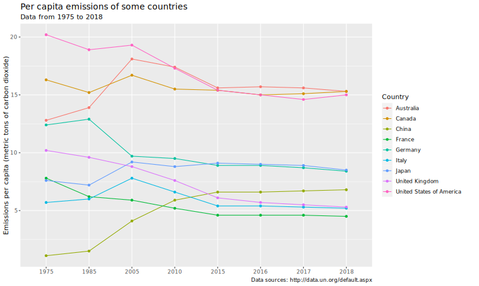
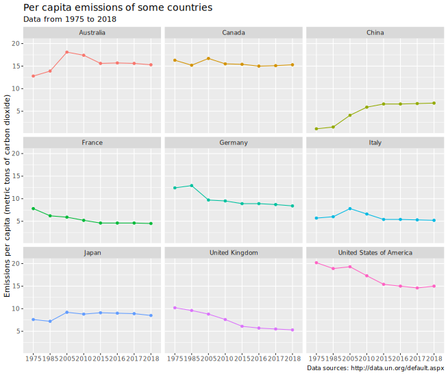

> 数据来源：[Carbon Dioxide Emission Estimates](http://data.un.org/_Docs/SYB/CSV/SYB64_310_202110_Carbon%20Dioxide%20Emission%20Estimates.csv)

## 简介

数据来源于[undata](http://data.un.org/default.aspx)。最后更新于2021年11月1日。它包含了几年来世界各国总碳排放量和人均碳排放量。由于国家数量众多，在本数据分析中，我们仅选择了九个国家，即中国、美国、法国、德国、加拿大、意大利、日本、英国和奥地利。

## 绘制图像

> 我们希望对这九个国家的数据有直观了解，所以选择在同一个图表中绘制

### 导入

第一步是将原始数据导入程序代码。

```R
data_csv <- read.csv("SYB64_310_202110_Carbon Dioxide Emission Estimates.csv")
```

### 数据清洗

我们需要从数据集中筛选出这九个国家的数据，为了能够进行比较，我们只需要人均数据，而不是总体数据。

```R
world_data <- data_csv %>%
  filter(Country %in% c("China", "United States of America", "United Kingdom", "France", "Germany", "Australia", "Japan", "Canada", "Italy")) %>%
  filter(Series == "Emissions per capita (metric tons of carbon dioxide)")
```

### 可视化

只需要按国家、年份作为 x 坐标，以及人均排放量作为 y 坐标来绘制数据集。

```R
world_plot <- world_data %>%
  ggplot(mapping = aes(
    x = factor(Year),
    y = as.numeric(Value),
    color = Country,
    fill = Country,
    group = Country,
  ))

world_plot +
  geom_point() +
  geom_line() +
  labs(
    x = NULL,
    y = "Emissions per capita (metric tons of carbon dioxide)",
    title = "Per capita emissions of some countries",
    subtitle = "Data from 1975 to 2018",
    caption = "Data sources: http://data.un.org/default.aspx",
  ) +
  theme(
    plot.title = element_text(size = 14), # title position
    text = element_text(family = "JetBrains Mono"), # font
  )
```



### 研究结论

1. 总的来说，自 2015 年以来，各国的排放量趋于平稳。
2. 自 1975 年以来，各国人均碳排放量呈现增减交替的趋势，并趋于稳定。
3. 总的来说，澳大利亚、加拿大和美国的人均碳排放量远远超过其他国家。

{}
```R
library(tidyverse)
library(ggplot2)

data_csv <- read.csv("SYB64_310_202110_Carbon Dioxide Emission Estimates.csv")

world_data <- data_csv %>%
  filter(Country %in% c("China", "United States of America", "United Kingdom", "France", "Germany", "Australia", "Japan", "Canada", "Italy")) %>%
  filter(Series == "Emissions per capita (metric tons of carbon dioxide)")

world_plot <- world_data %>%
  ggplot(mapping = aes(
    x = factor(Year),
    y = as.numeric(Value),
    color = Country,
    fill = Country,
    group = Country,
  ))

world_plot +
  geom_point() +
  geom_line() +
  labs(
    x = NULL,
    y = "Emissions per capita (metric tons of carbon dioxide)",
    title = "Per capita emissions of some countries",
    subtitle = "Data from 1975 to 2018",
    caption = "Data sources: http://data.un.org/default.aspx",
  ) +
  theme(
    plot.title = element_text(size = 14), # title position
    text = element_text(family = "JetBrains Mono"), # font
  )
```
{}

## 按国家划分的数据图

### 可视化

- 我们只需要在上述基础上添加一个语句来按国家分隔图表。
- 同时，由于国家数据已经包含在各种图表中，我们不需要额外的图例。

```R
world_plot <- world_data %>%
  ggplot(mapping = aes(
    x = factor(Year),
    y = as.numeric(Value),
    color = Country,
    fill = Country,
    group = Country,
  ))

world_plot +
  geom_point() +
  geom_line() +
  facet_wrap(~Country) +
  labs(
    x = NULL,
    y = "Emissions per capita (metric tons of carbon dioxide)",
    title = "Per capita emissions of some countries",
    subtitle = "Data from 1975 to 2018",
    caption = "Data sources: http://data.un.org/default.aspx",
  ) +
  theme(
    legend.position = "none",
    plot.title = element_text(size = 14), # title position
    text = element_text(family = "JetBrains Mono"), # font
  )
```



### 研究结论

1. 加拿大、法国、德国、意大利和日本整体上变化不大。
2. 美国近年来持续下降，而中国正在上升。

{}
```R
library(tidyverse)
library(ggplot2)

data_csv <- read.csv("SYB64_310_202110_Carbon Dioxide Emission Estimates.csv")

world_data <- data_csv %>%
  filter(Country %in% c("China", "United States of America", "United Kingdom", "France", "Germany", "Australia", "Japan", "Canada", "Italy")) %>%
  filter(Series == "Emissions per capita (metric tons of carbon dioxide)")

world_plot <- world_data %>%
  ggplot(mapping = aes(
    x = factor(Year),
    y = as.numeric(Value),
    color = Country,
    fill = Country,
    group = Country,
  ))

world_plot +
  geom_point() +
  geom_line() +
  facet_wrap(~Country) +
  labs(
    x = NULL,
    y = "Emissions per capita (metric tons of carbon dioxide)",
    title = "Per capita emissions of some countries",
    subtitle = "Data from 1975 to 2018",
    caption = "Data sources: http://data.un.org/default.aspx",
  ) +
  theme(
    legend.position = "none",
    plot.title = element_text(size = 14), # title position
    text = element_text(family = "JetBrains Mono"), # font
  )
```
{}