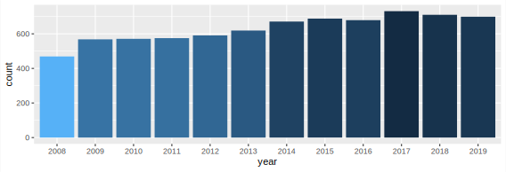

> Data sources:[Jail deaths in America: data and key findings of _Dying Inside_](https://www.reuters.com/investigates/special-report/usa-jails-graphic/)
>
> It contains data on large prisons with 750 or more prisoners in the United States. In order to ensure that it checked the number of deaths across the country, it also included data on the 10 largest prisons in each state.
>
> These data cover 523 prisons or prison systems. The data covers the period from 2008 to 2019.

## Introduction

**The U.S. government** does not release jail by jail mortality data, keeping the public and policy makers in the dark about facilities with high rates of death. In a first-of-its-kind accounting, Reuters obtained and is releasing that data to the public.

What if the jail in your community had an outsized death rate, but no one knew? For decades, communities across the country have faced that quandary. The Justice Department collects jail death data, but locks the information away, leaving policymakers, investigators and activists unaware of problem facilities.

Reuters journalists filed **more than 1,500 public records requests to gain death data from 2008 to 2019 in the nation’s biggest jails**. Today, jail by jail and state by state, it is making that information available to the public. Reuters examined every large jail in the United States, those with 750 or more inmates. And, to ensure it examined deaths across the country, it obtained data for the 10 largest jails in each state. The data covers 523 jails or jail systems.

## Deaths in Large US Prisons

Used librarys: `tidyverse`, `ggplot2`

### Import

The first step is import the raw data to the program code.

```R
data_csv <- read.csv("all_deaths.csv")
```

### Selection

We want to have an intuitive understanding of the data as a whole. At this time, we don't need specific details, so we only filter out the year data.

```R
death_count <- data_csv %>%
  select(year) %>%
  count(year, name = "count") %>%
  mutate(year = factor(year, levels = seq(2008, 20019, by = 1)))
```

Note that in this code snippet, we convert year to a factor so that the x-axis coordinates of the histogram are scattered year data, using the `mutata` function.

### Plot

We chose `ggplot2` to draw exquisite and intuitive data analysis images.

We use year as the parameter of the x-axis. Since we have previously calculated the occurrence frequency of each year, we only need to specify X and Y.

```R
dataplot <- death_count %>%
  ggplot(mapping = aes(
    x = year,
    y = count,
  ))
  geom_col()
```


- Since the data display is not intuitive, we add color to it and according to the principle that the larger the data, the darker the color.
- Because we don't need to annotate the color, we add the `guides(fill = FALSE)` statement.
- Then we add a specific number display to each bar diagram to make the image intuitive and detailed.

```R
dataplot <- death_count %>%
  ggplot(mapping = aes(
    x = year,
    y = count,
    fill = -log(count),
  )) +
  guides(fill = FALSE) +
  geom_col() +
  geom_text(mapping = aes(
    label = count,
  ))
```



### Add auxiliary information

Finally, we add auxiliary information to expand the chart, including the title, subtitle, and data source.

Then fine-tune the title position and select the appropriate font family to further upgrade the image effect.

```R
dataplot +
  labs(
    x = NULL,
    y = "Death toll",
    title = "Total number of deaths in large prisons in the United States",
    subtitle = "death data from 2008 to 2019 in the nation's biggest jails",
    caption = "Data sources: https://www.reuters.com/investigates/special-report/usa-jails-graphic/", # nolint
  ) +
  theme(
    plot.title = element_text(hjust = 0.5, size = 14), # title position
    text = element_text(family = "JetBrains Mono"), # font
  )
```


### Conclusions of the study

Between 2008 and 2019, the number of deaths in large prisons in the United States gradually increased, from 469 to a maximum of 731, and gradually stabilized at about 700.

{}
```R
library(tidyverse)
library(ggplot2)

# Import
data_csv <- read.csv("all_deaths.csv")

# data select
death_count <- data_csv %>%
  select(year) %>%
  count(year, name = "count") %>%
  mutate(year = factor(year, levels = seq(2008, 20019, by = 1)))

# Plot
dataplot <- death_count %>%
  ggplot(mapping = aes(
    x = year,
    y = count,
    fill = -log(count),
  )) +
  # guides(fill = FALSE) +
  geom_col() +
  geom_text(mapping = aes(
    label = count,
  ))

# Add auxiliary information.
dataplot +
  labs(
    x = NULL,
    y = "Death toll",
    title = "Total number of deaths in large prisons in the United States",
    subtitle = "death data from 2008 to 2019 in the nation's biggest jails",
    caption = "Data sources: https://www.reuters.com/investigates/special-report/usa-jails-graphic/", # nolint
  ) +
  theme(
    legend.position = "none",
    plot.title = element_text(hjust = 0.5, size = 14), # title position
    text = element_text(family = "JetBrains Mono"), # font
  )
```
{}

## Prison deaths by state

> In this part, we try to further explore the details of prison deaths in the United States on a state by state basis.

### Import

The first step is import the raw data to the program code.

```R
data_csv <- read.csv("all_deaths.csv")
```

### Process raw data

Since we need the total number of deaths in all prisons in each state each year, we first use `table` to calculate the same information.

Then we will change the table format to a data box form again, and change the index name to facilitate our subsequent plotting.

```R
data_csv <- table(data_csv$year, data_csv$state) %>%
  as.data.frame() %>%
  rename(year = Var1, state = Var2, count = Freq)
```

### Plot

Based on the processing of the above data, we can efficiently make a broken line chart of the number of deaths in large prisons in various states on an image to facilitate follow-up analysis.

```R
data_plot <- data_csv %>%
  ggplot(mapping = aes(
    x = year,
    y = count,
    group = state,
    color = state,
  ))

data_plot + geom_line() + labs(
  x = NULL,
  y = "Death toll",
  title = "Prison deaths by state in the United States",
  subtitle = "death data from 2008 to 2019 in the nation's biggest jails",
  caption = "Data sources: https://www.reuters.com/investigates/special-report/usa-jails-graphic/", # nolint
) +
  theme(
    plot.title = element_text(hjust = 0.6, size = 14), # title position
    text = element_text(family = "JetBrains Mono"), # font
  )
```


### Conclusions of the study

1. We can clearly see that most of the data curves are gathered in one place, speculating because the prison is similar in size.
2. The data from four states is very eye-catching.
   - California
   - Florida
   - Texas
   - Pennsylvania
3. The data of the four states mentioned above far exceeds that of other states. It is reasonable to speculate that there may be more and larger prisons, and there may be relatively high crime rates.

{}
```R
library(tidyverse)
library(ggplot2)

data_csv <- read.csv("all_deaths.csv")

data_csv <- table(data_csv$year, data_csv$state) %>%
  as.data.frame() %>%
  rename(year = Var1, state = Var2, count = Freq)

data_plot <- data_csv %>%
  ggplot(mapping = aes(
    x = year,
    y = count,
    group = state,
    color = state,
  ))

data_plot + geom_line() + labs(
  x = NULL,
  y = "Death toll",
  title = "Prison deaths by state in the United States",
  subtitle = "death data from 2008 to 2019 in the nation's biggest jails",
  caption = "Data sources: https://www.reuters.com/investigates/special-report/usa-jails-graphic/", # nolint
) +
  theme(
    plot.title = element_text(hjust = 0.6, size = 14), # title position
    text = element_text(family = "JetBrains Mono"), # font
  )
```
{}