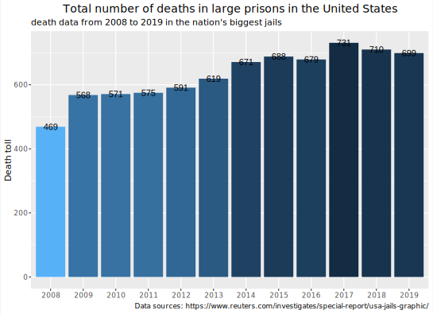

> 数据来源：[美国监狱死亡事件：_Dying Inside_的数据和关键发现](https://www.reuters.com/investigates/special-report/usa-jails-graphic/)
>
> 包含美国750名及以上囚犯的大型监狱数据。为确保涵盖全国死亡人数，它还包括了每个州前10大监狱的数据
>
> 涵盖2008年至2019年的523个监狱系统

## 简介

**美国政府**不按监狱发布死亡率数据，使公众和政策制定者对死亡率高的设施处于黑暗之中。在首次此类统计中，路透社获得了这些数据并向公众发布。

如果你们社区里的监狱死亡率异常高，但没有人知道呢？几十年来，全国各地的社区都面临着这种困境。司法部收集监狱死亡数据，但将信息锁起来，使得政策制定者、调查人员和活动家对问题设施一无所知。

路透社记者提交了**1500多项公开记录请求，以获取2008年至2019年该国最大监狱的死亡数据**。今天，他们正逐个监狱、逐个州地公开这些信息。路透社审查了美国所有大型监狱，包括那些关押750名或以上囚犯的监狱。为确保审查覆盖全国，它还获得了每个州前10大监狱的数据。这些数据涵盖了523个监狱或监狱系统。

## 美国大型监狱的死亡人数

使用到的包：`tidyverse`, `ggplot2`

### 导入

第一步是将原始数据导入程序代码。

```R
data_csv <- read.csv("all_deaths.csv")
```

### 筛选

我们希望对整个数据有一个直观的理解。目前我们不需要具体细节，只按年筛选数据。

```R
death_count <- data_csv %>%
  select(year) %>%
  count(year, name = "count") %>%
  mutate(year = factor(year, levels = seq(2008, 20019, by = 1)))
```

请注意，在这个代码片段中，我们使用`mutata`函数将年份转换为因子，以便直方图的x轴坐标是散布的年份数据。

### 绘图

我们选择了`ggplot2`来绘制精美直观的数据分析图像，使用年份作为x轴的参数。由于我们之前已经计算了每年出现的频率，我们只需要指定X和Y。

```R
dataplot <- death_count %>%
  ggplot(mapping = aes(
    x = year,
    y = count,
  ))
  geom_col()
```


- 由于数据展示不直观，我们为其添加颜色，并按照数据越大颜色越深的原理。
- 因为我们不需要标注颜色，所以我们添加了`guides(fill = FALSE)`语句。
- 然后我们在每个条形图中添加具体的数字显示，使图像直观且详细。

```R
dataplot <- death_count %>%
  ggplot(mapping = aes(
    x = year,
    y = count,
    fill = -log(count),
  )) +
  guides(fill = FALSE) +
  geom_col() +
  geom_text(mapping = aes(
    label = count,
  ))
```


### 添加辅助信息

最后，我们添加辅助信息以扩展图表，包括标题、副标题和数据来源。然后微调标题位置并选择合适的字体，以进一步提升图像效果。

```R
dataplot +
  labs(
    x = NULL,
    y = "Death toll",
    title = "Total number of deaths in large prisons in the United States",
    subtitle = "death data from 2008 to 2019 in the nation's biggest jails",
    caption = "Data sources: https://www.reuters.com/investigates/special-report/usa-jails-graphic/", # nolint
  ) +
  theme(
    plot.title = element_text(hjust = 0.5, size = 14), # title position
    text = element_text(family = "JetBrains Mono"), # font
  )
```



### 研究结论

2008年至2019年间，美国大型监狱的死亡人数逐渐增加，从469人增至最多731人，并逐渐稳定在约700人左右。

{}
```R
library(tidyverse)
library(ggplot2)

# Import
data_csv <- read.csv("all_deaths.csv")

# data select
death_count <- data_csv %>%
  select(year) %>%
  count(year, name = "count") %>%
  mutate(year = factor(year, levels = seq(2008, 20019, by = 1)))

# Plot
dataplot <- death_count %>%
  ggplot(mapping = aes(
    x = year,
    y = count,
    fill = -log(count),
  )) +
  # guides(fill = FALSE) +
  geom_col() +
  geom_text(mapping = aes(
    label = count,
  ))

# Add auxiliary information.
dataplot +
  labs(
    x = NULL,
    y = "Death toll",
    title = "Total number of deaths in large prisons in the United States",
    subtitle = "death data from 2008 to 2019 in the nation's biggest jails",
    caption = "Data sources: https://www.reuters.com/investigates/special-report/usa-jails-graphic/", # nolint
  ) +
  theme(
    legend.position = "none",
    plot.title = element_text(hjust = 0.5, size = 14), # title position
    text = element_text(family = "JetBrains Mono"), # font
  )
```
{}

## 各州监狱死亡人数

> 在这个部分，我们试图进一步按州探索美国监狱死亡事件的细节

### 导入

第一步是将原始数据导入程序代码。

```R
data_csv <- read.csv("all_deaths.csv")
```

### 处理原始数据

由于我们需要每年每个州所有监狱的总死亡人数，我们首先使用`table`来计算相同的信息。然后我们将表格格式再次改为数据框形式，并更改索引名称以方便我们后续的绘图。

```R
data_csv <- table(data_csv$year, data_csv$state) %>%
  as.data.frame() %>%
  rename(year = Var1, state = Var2, count = Freq)
```

### 绘图

根据上述数据处理，我们可以在图像上高效地绘制出各州大型监狱死亡人数的折线图，以方便后续分析。

```R
data_plot <- data_csv %>%
  ggplot(mapping = aes(
    x = year,
    y = count,
    group = state,
    color = state,
  ))

data_plot + geom_line() + labs(
  x = NULL,
  y = "Death toll",
  title = "Prison deaths by state in the United States",
  subtitle = "death data from 2008 to 2019 in the nation's biggest jails",
  caption = "Data sources: https://www.reuters.com/investigates/special-report/usa-jails-graphic/", # nolint
) +
  theme(
    plot.title = element_text(hjust = 0.6, size = 14), # title position
    text = element_text(family = "JetBrains Mono"), # font
  )
```


### 研究结论

1. 可以清楚地看到，大部分数据曲线都聚集在一个地方，猜测是因为监狱的规模相似。
2. 四个州的数据非常引人注目：
   - 加利福尼亚
   - 佛罗里达
   - 德克萨斯
   - 宾夕法尼亚
3. 上文提到的四个州的数据远远超过其他州。合理推测可能存在更多更大的监狱，并且可能有相对较高的犯罪率。

{}
```R
library(tidyverse)
library(ggplot2)

data_csv <- read.csv("all_deaths.csv")

data_csv <- table(data_csv$year, data_csv$state) %>%
  as.data.frame() %>%
  rename(year = Var1, state = Var2, count = Freq)

data_plot <- data_csv %>%
  ggplot(mapping = aes(
    x = year,
    y = count,
    group = state,
    color = state,
  ))

data_plot + geom_line() + labs(
  x = NULL,
  y = "Death toll",
  title = "Prison deaths by state in the United States",
  subtitle = "death data from 2008 to 2019 in the nation's biggest jails",
  caption = "Data sources: https://www.reuters.com/investigates/special-report/usa-jails-graphic/", # nolint
) +
  theme(
    plot.title = element_text(hjust = 0.6, size = 14), # title position
    text = element_text(family = "JetBrains Mono"), # font
  )
```
{}