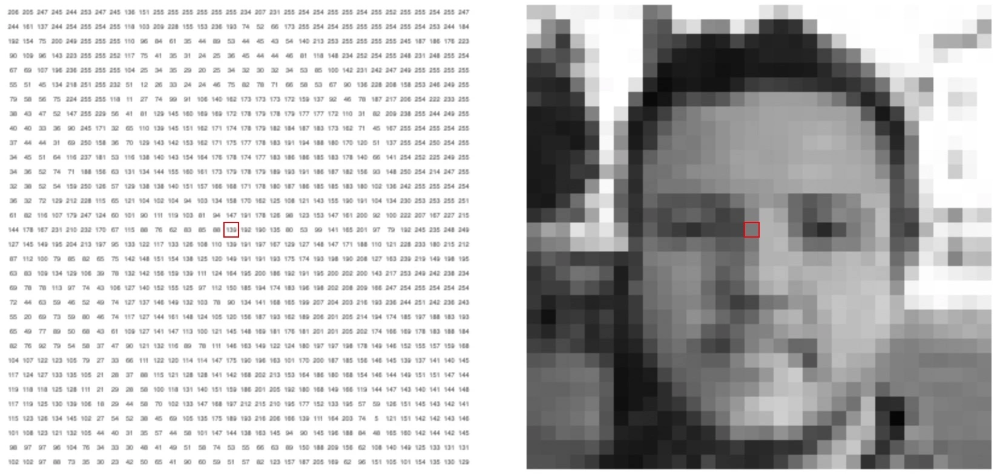
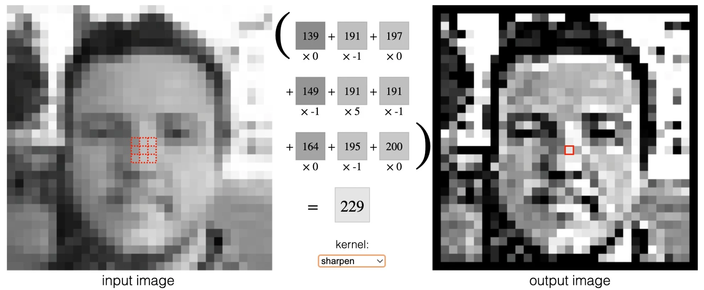




图像是由一个一个像素点组成的，处理图像的本质就是处理这些像素点。像素之间的关联性是重要的信息，不能完全把像素点割裂开来，这一点也正是众多图像算法的出发点。卷积（Convolution）是数学中的一种常用的运算。在图像处理中，它通过将图像和卷积核进行运算来改变图像的细节。图像的卷积或滤波操作在各种场合应用很普遍，如各种滤镜、卷积神经网络等。本文将将通过图像滤波，探讨在图像处理领域的卷积中应用的线性代数知识。


## 图像处理介绍

图像处理是指对图像进行分析、加工和处理，使其满足视觉、心理或其他要求的技术。图像处理是信号处理在图像领域上的一个应用。目前大多数的图像均是以数码形式存储，因而图像处理很多情况下指数字图像处理。此外，基于光学理论的处理方法依然占有重要的地位。

图像在计算机中由大量看似连续的像素构成，在数学上图像的每个像素可以对应为线性代数里矩阵的每个元素，因此使用矩阵表示图像。图像的种类不同，矩阵的维数会有变化：灰度格式的图像可用一个元素值介于0～255之间的二维矩阵来表示，元素值的大小对应着像素点的亮度（0对应黑色，255对应白色）；彩色图像（RGB图像）可用三维矩阵表示，红（R）、绿（G）、蓝（B）三个分量分别用一个矩阵表示，3个矩阵组合起来构成三维矩阵。可以说，图像就等于矩阵，所以线性代数中有关矩阵理论的成果可以应用于图像处理上。

## 图像的简单几何变化

将图像信息看作矩阵进行处理，我们能够利用线性代数中有关矩阵理论的知识对图像进行简单的几何变化。下面介绍几种常见的图像几何变换原理，其中\\(x'\\)，\\(y'\\)为平移后图像像素坐标，\\(x_0\\)，\\(y_0\\)为各方向偏移量，\\(x\\)，\\(y\\)为原图像中像素坐标。

### 平移（Translation）

$$
\begin{bmatrix}
x' \cr y' \cr 1
\end{bmatrix} =
\begin{bmatrix}
1&0&x_0\cr 0&1&y_0\cr 0&0&1
\end{bmatrix}
\begin{bmatrix}
x \cr y \cr 1
\end{bmatrix}
$$

### 旋转（Rotation）

$$
\begin{bmatrix}
x' \cr y' \cr 1
\end{bmatrix} =
\begin{bmatrix}
cos\theta&-sin\theta&0 \cr
sin\theta&cos\theta&0 \cr
0&0&1
\end{bmatrix}
\begin{bmatrix}
x \cr y \cr 1
\end{bmatrix}
$$

旋转后可能无法完美的映射至每一个新的像素点，故需要后期对旋转后的图像进行修复，但通常由于缺失的点并不多，可采用取前一像素的RGB值来实现。

### 缩放（Scale）

$$
\begin{bmatrix}
x' \cr y' \cr 1
\end{bmatrix} =
\begin{bmatrix}
c&0&0 \cr 0&d&0 \cr 0&0&1
\end{bmatrix}
\begin{bmatrix}
x \cr y \cr 1
\end{bmatrix}
$$

显然，放大后会出现没有图像信息的空格，故需要对这些空格进行补充。我们可以使用`双线性插值`对输出图像进行插值补充。

{}

分别在左上、右上、左下、右下四个方向寻找最近且有有效RGB信息的像素点，计算其到需要插值的像素点的距离  \\(d_{ul}\\), \\(d_{ur}\\), \\(d_{dl}\\), \\(d_{dr}\\), 根据其反比关系给予对应点权值，即有

$$p_{ul}:p_{ur}:p_{dl}:p_{dr}= {1\over d_{ul}}:{1\over d_{ur}}:{1\over d_{dl}}:{1\over d_{dr}}$$



将权值映射至\\([0,1]\\), 然后对需插值点的每个通道进行加权赋值：

$$\begin{bmatrix}
R' \cr G' \cr B'
\end{bmatrix}=p_{ul}\begin{bmatrix}
R_{ul} \cr G_{ul} \cr B_{ul}
\end{bmatrix}+p_{ur}\begin{bmatrix}
R_{ur} \cr G_{ur} \cr B_{ur}
\end{bmatrix}+p_{dl}\begin{bmatrix}
R_{dl} \cr G_{dl} \cr B_{dl}
\end{bmatrix}+p_{dr}\begin{bmatrix}
R_{dr} \cr G_{dr} \cr B_{dr}
\end{bmatrix}$$

对所有间隙进行以上操作即可完成整张图像的插值

{}

### 错切（Shear）

1. shear on axis-x（沿x轴错切）\\(\begin{bmatrix}
   x' \cr y' \cr 1
   \end{bmatrix}=\begin{bmatrix}
   1&d_x&0 \cr 0&1&0 \cr 0&0&1
   \end{bmatrix}\begin{bmatrix}
   x \cr y \cr 1
   \end{bmatrix}\\)

2. shear on axis-y（沿y轴错切）\\(\begin{bmatrix}
   x' \cr y' \cr 1
   \end{bmatrix}=\begin{bmatrix}
   1&0&0 \cr d_y&1&0 \cr 0&0&1
   \end{bmatrix}\begin{bmatrix}
   x \cr y \cr 1
   \end{bmatrix}\\)

### 镜像（Mirror）

$$
\begin{bmatrix}
x' \cr y' \cr 1
\end{bmatrix}=
\begin{bmatrix}
s_x&0&0 \cr 0&s_y&1 \cr 0&0&1
\end{bmatrix}
\begin{bmatrix}
x \cr y \cr 1
\end{bmatrix}
$$

## 卷积

### 原理

卷积是两个变量在某范围内相乘后求和的结果。卷积一词最开始出现在信号与线性系统中，信号与线性系统中讨论的就是信号经过一个线性系统以后发生的变化。由于现实情况中常常是一个信号前一时刻的输出影响着这一时刻的输出，所在一般利用系统的单位响应与系统的输入求卷积，以求得系统的输出信号（当然要求这个系统是线性时不变的）。

如果卷积的变量是序列\\(x(n)\\)和\\(h(n)\\)，则卷积的结果：

$$
y(n)=\sum_{i=-\infty}^{\infty} x(i) h(n-i)=x(n) * h(n)
$$

### 图像处理中的卷积

在图像处理中，卷积可以用来对图像进行滤波、特征提取和其他处理。卷积运算在数学上可以用线性代数的方法来描述，其实也是仿射变换的一种：对输入向量进行线性变换。

卷积满足线性函数的定义，若\\(f(𝑥)\\)满足以下两个条件, 则说\\(f(𝑥)\\)是一个线性函数:

$$
\begin{aligned}
𝑓(𝑥1+𝑥2) &= 𝑓(𝑥1)+𝑓(𝑥2) \cr
𝑓(𝑎𝑥) &= 𝑎𝑓(𝑥)
\end{aligned}
$$

由于数字图像是一个二维的离散信号，对数字图像做卷积操作其实就是利用卷积核在图像上滑动，将图像点上的像素值与对应的卷积核上的数值相乘，然后将所有相乘后的值相加作为卷积核中间像素对应的图像上的像素值。最终滑动完所有像素，这样新图像中的每个像素值就是原图像的一部分像素值和卷积核的权值的乘积之和。

给定一个输入图像\\(f(x,y)\\)和一个卷积核\\(g(x,y)\\)，卷积运算的结果是一个新的图像\\(h(x,y)\\)，其中

$$
h(x,y) = ∑∑ f(u,v) * g(x-u, y-v)
$$

卷积核\\(g(x,y)\\)是一个小的矩阵，用来对输入图像进行卷积运算，而输出图像\\(h(x,y)\\)则是一个新的图像，它是由\\(g(x,y)\\)与\\(f(x,y)\\)的卷积而得到的。设\\(H\\)是卷积运算的结果，是一个新的矩阵，\\(F\\)是输入图像的矩阵表示，\\(G\\)是卷积核的矩阵表示，那么卷积运算可以表示为：\\(H = G * F\\)

## 图像滤波

图像滤波的目的是在尽量保留图像特征的条件下，过滤掉图像中的噪声，是图像预处理中不可缺少的操作，其滤波效果直接影响到后续图像识别、分析等算法的效果。

对图像的滤波处理的本质就是对图像应用一个卷积核。通过不同的卷积核，可以实现不同的图像处理效果，例如增强边缘、去除噪声、提取特征等。

以下是关于卷积核的一些总结：

- 卷积核往往是行数和列数均为奇数的矩阵，这样中心较好定位。
- 卷积核元素的总和体现出输出的亮度，若元素总和为1，卷积后的图像与原图像亮度基本一致；若元素总和为0，则卷积后的图像基本上是黑色，其中较亮的部分往往就是提取出图像的某种特征。
- 高通滤波器（High Pass Filter, HPF）表示仅允许图像中高频部分（即图片中变化较剧烈的部分）通过，往往用于对图像进行锐化处理、增强图像中物体边缘等。
- 低通滤波器（Low Pass Filter, LPF）表示仅允许图像中低频部分（即图片中变化较平缓的部分）通过，往往用于对图像进行模糊/平滑处理、消除噪点等。

下面给出一些图像滤波方法并附上效果示意图供参考。

###  图像的均值滤波

> \\(x'\\),\\(cy'\\)为平移后图像像素坐标，\\(x_0\\),\\(y_0\\)为各方向偏移量，\\(x\\),\\(y\\)为原图像像素坐标

均值滤波器的主要应用是去除图像中的不相干细节，即那些与滤波掩模尺寸相比更小的像素区域。通过一个掩膜（以\\(3\times 3\\)为例）对每个像素及其周围一周的像素取平均后重新赋值来实现。

$$
Pixel'={1\over9}\times
\begin{bmatrix} 1&1&1 \end{bmatrix}
\begin{bmatrix}
1\cdot P_{ul} & 1\cdot P_{up} & 1\cdot P_{ur} \cr
1\cdot P_{l} & 1\cdot P & 1\cdot P_{r} \cr
1\cdot P_{dl} & 1\cdot P_{down} & 1\cdot P_{dr}
\end{bmatrix}
\begin{bmatrix} 1 \cr 1 \cr 1 \end{bmatrix}
$$



  
  



### 拉普拉斯图像增强

**原理**：Laplace算子可以近似计算出图像的二阶导数，具有旋转不变性，也就是可以检测出各个方向的边缘。

**拉普拉斯算子**：

$$
\nabla^2f={\partial^2f\over\partial x^2}+{\partial^2f\over\partial y^2}
$$

其中有：

$$
\begin{aligned}
{\partial^2f\over\partial x^2}=f(x+1,y)+f(x-1,y)-2f(x,y) \cr
{\partial^2f\over\partial y^2}=f(x,y+1)+f(x,y-1)-2f(x,y)
\end{aligned}
$$

将对角线方向加入讨论之后

$$
\begin{aligned}
{\nabla^2f}=[f(x-1,y-1)+f(x,y-1)+f(x-1,y)+f(x+1,y)+\cr
f(x-1,y+1)+f(x,y+1)+f(x+1, y+1)]-8f(x,y)
\end{aligned}
$$

由于边缘处存在像素信息值的陡然变化，即一阶导数有一个极大值，于是可以通过这一特点，对其进一步求二阶导等于0，上式是对二阶导离散化后的结果。通过拉普拉斯算子，可以取出图像的信息值(RGB某一通道值)突变的部分，这一部分便是图像的边缘部分，最后与原图像叠加，从而获得边缘增强（锐化）的图像。（其中\\(Pixel'\\)为变换后图像像素坐标）

1) 滤波：

$$
Pixel'={1\over9} \times
\begin{bmatrix} 1&1&1 \end{bmatrix}
\begin{bmatrix}
1\cdot P_{ul} & 1\cdot P_{up} & 1\cdot P_{ur} \cr
1\cdot P_{l} & -8\cdot P & 1\cdot P_{r} \cr
1\cdot P_{dl} & 1\cdot P_{down} & 1\cdot P_{dr}
\end{bmatrix}
\begin{bmatrix}
1 \cr 1 \cr 1
\end{bmatrix}
$$

2) 叠加：

$$
Pixel''=Pixel - Pixel'
$$



  
  


