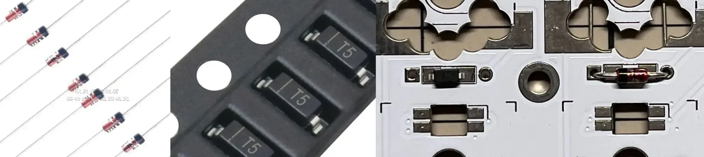

 Please note that if you encounter any difficulties during the installation process, please fully utilize your **DIY abilities** and use various feasible parts. 

## Switch Socket

Please select the corresponding keyboard switch socket according to the selected PCB.

> MX switch and Gateron low-profile switch for normal version, MX switch and Kailh low-profile switch for choc version

## RGB

A single side needs 23 key lights and 6 bottom lights in series, so please install all or none at all. For the convenience of selection and manual soldering, we only use `SK6812MINI-E`. The position for installing the GND pin has been marked on the PCB. When installing, just pay attention to have the LED facing downwards and the bottom light facing upwards.

 They are in opposite directions 

## Diode

Each keyboard switch corresponds to a diode. You can freely choose between surface-mount diodes or through-hole diodes, and even install them on the front or back of the PCB (note that installing on the back **may conflict** with the case).

 Please make sure that the direction of the diode is correct 

## Switch and Battery

The reset and boot switches, as well as the power socket, are very easy to solder. It is not necessary to elaborate here. It is worth noting that the protruding pins on the back of the straight plug switch should be polished and trimmed to avoid affecting the installation of the housing.

 Please be careful to pay attention to the battery wire sequence 

## Chip and Oled

Since the PCB is double-sided, you can install the chip on either side, whether it is directly soldered or connected with a socket. The position where the chip pins should be installed is marked on each side, be careful not to solder incorrectly.

 If you want to use 3D printed shell, be sure to follow the steps below! 

It is recommended to use the low-profile slot to install the chip on the front of the keyboard. Pay attention to installing the slot on the column marked on the PCB. When installing the chip, make sure that its back side (the flat side without components) faces up. Finally, when installing the OLED screen, please make sure they are installed tightly.

## Case

### 3D Printed

First, install five hot-melt screws into the 3D printed case, then place the completed PCB inside, tighten the five screws, and finally install the back panel and front OLED acrylic.

### Transparent Explorer

This case does not have much to pay attention to, only using m2 screws and two-stage screws for connection.

## Key

The final step is to install the keyboard switches and keycaps, just align them, very simple, please feel free to use your creativity to mix and match.

## Firmware

This keyboard uses ZMK as the firmware. Please `fork` my [zmk-config](https://github.com/hza2002/zmk-config) repository and the [zmk official documentation](https://zmk.dev/docs/user-setup#github-repo). It is recommended to use `GitHub Action` and [keymap-editor](https://nickcoutsos.github.io/keymap-editor/) for web-based visual firmware building.

The method of flashing firmware is very simple. Just press the boot button twice quickly to enter boot mode, and the keyboard controller will appear on the computer like a USB flash drive. Drag and drop the firmware to update it.
