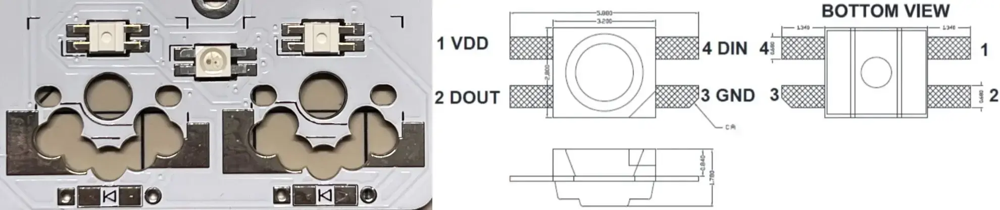
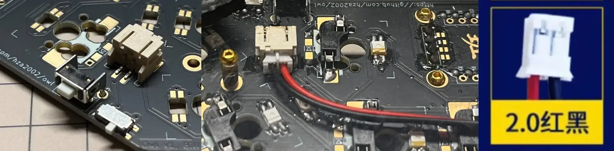
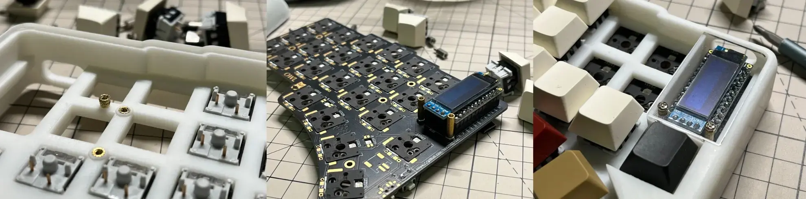
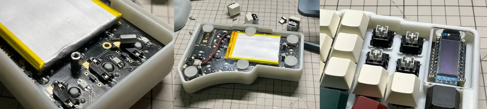

 如果您在安装过程中遇到任何困难，请充分发挥**DIY能力**，使用各种可行的部件 

## Switch Socket

请根据所选的 PCB 选择相应的轴座。

> 普通版本可用标准轴和佳达隆矮轴，Choc 版本使用标准轴和凯华矮轴

## RGB

单面需要 23 个轴灯和 6 个底灯，因此串联所以请全部安装或不安装。为了便于拿取和手动焊接，只使用 `SK6812MINI-E`。已在 PCB 上标记了安装 GND 引脚的位置。安装时，只需注意轴灯 LED 面朝下，底灯 LED 面朝上。

 它们的方向相反 

## 二极管

每个轴对应一个二极管，可自由选择贴片二极管或穿孔二极管，可以自由选择安装在 PCB 的两面（在背面安装可能会与外壳**发生冲突**）。

 无论如何，请确保二极管的方向正确 

## 开关与电池

重置和启动开关以及电源插座非常容易焊接。值得注意的是，直插式开关背面凸出的针脚应该打磨和修剪，以免影响外壳的安装。

 请注意电池正负极的顺序 

## 芯片和 Oled

由于 PCB 是双面，可以将芯片安装在任何一侧，无论是直接焊接还是连接到插座上。应该安装芯片引脚的位置在每一侧都有标记，请小心不要焊接错误。

 如果你想使用 3D 打印外壳，请务必遵循以下步骤！ 

建议使用矮插槽在键盘正面安装芯片，安装插槽时请注意对准印刷线路板上标记的列，安装芯片时请确保芯片背面（无元件的平面一面）朝上。最后，安装 OLED 屏幕时请确保安装牢固。

## 外壳

### 3D 打印外壳

首先，将五个热熔螺母安装到 3D 打印外壳中，然后将完成的 PCB 放置其中，拧紧五个螺柱，最后安装背板和正面 OLED 亚克力保护板。

### 透明外壳

这种外壳没有太多需要注意的地方，只需使用 M2 螺柱和螺丝进行连接。

## 轴体

硬件最后一步是安装轴体和键帽，最简单的一步，请尽情发挥您的创造力进行搭配。

## 固件

此键盘使用 ZMK 作为固件，请 `fork` 我的 [zmk-config](https://github.com/hza2002/zmk-config) 仓库和 [zmk 官方文档](https://zmk.dev/docs/user-setup#github-repo)，推荐使用 `GitHub Action` 和[keymap-editor](https://nickcoutsos.github.io/keymap-editor/) 进行网页可视化固件构建。

刷固件非常简单，只需快速按两次启动按钮进入引导模式，键盘控制器就会像 U 盘一样出现在电脑里，将固件拖入即可更新。
