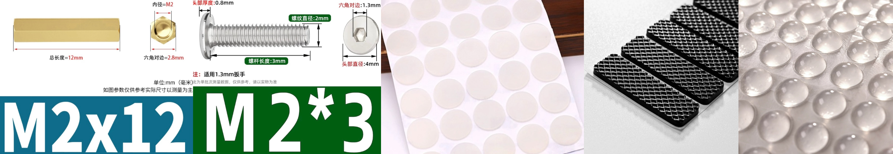
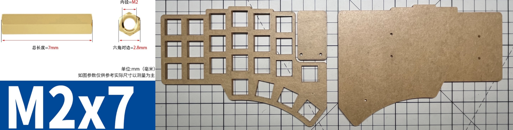
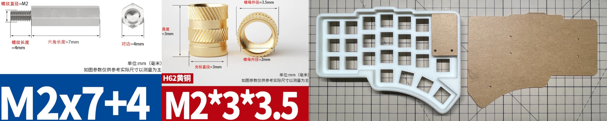

 Please read the guide carefully. If possible, please also refer to other split keyboard construction guides as reference. 

## PCB

| Name           | Count | Remarks                                                                              |
| :------------- | :---- | :----------------------------------------------------------------------------------- |
| PCB            | 2     | 1.6mm if use 3D printed case                                                         |
| ProMicro       | 2     | [nice!nano](https://nicekeyboards.com/nice-nano)                                     |
| Diodes         | 46    | SOD-123 or DO-35                                                                     |
| Reset switch   | 2     | 3\*6\*5                                                                              |
| Battery switch | 2     | MSK-1102-1.5H                                                                        |
| Battery socket | 2     | PH2.0 2P                                                                             |
| Battery        | 2     | 3.7V lithium (max size 40\*50\*70)                                                   |
| PCB sockets    | 46    | Compatible with MX and Gateron low profile, and Kailh choc if using choc version PCB |
| Key switches   | 46    | Only compatible with MX style                                                        |
| Keycaps        | 46    | 1u cap                                                                               |



## Optional

### RGB and Oled

| Name         | Count | Remarks                                            |
| :----------- | :---- | :------------------------------------------------- |
| OLED         | 2     | 0.91 inches                                        |
| SK6812MINI-E | 58    | Install all lights as they are connected in series |



### Case

#### General

| Name           | Count | Remarks                |
| :------------- | :---- | :--------------------- |
| Spacer M2 12mm | 4     | For OLED cover         |
| Screw M2       | 24    | At least 3mm           |
| Rubber feet    | ANY   | For anti-slip purposes |

#### Transparent Explorer

| Name          | Count | Remarks                      |
| :------------ | :---- | :--------------------------- |
| Top plate     | 2     | 1.5mm-4mm                    |
| Bottom plate  | 2     | At least 1.5mm               |
| OLED cover    | 2     | At least 1mm                 |
| Spacer M2 7mm | 10    | Between pcb and bottom plate |

#### 3D Printed

| Name                      | Count | Remarks                                 |
| :------------------------ | :---- | :-------------------------------------- |
| Spacer M2 7+4mm           | 10    | Between pcb and bottom plate            |
| Hot melt screw M2\*3\*3.5 | 10    | Used for integrating 3D printed case    |
| 3D-printed case        | 2     | Please select printing materials freely |
| OLED cover                | 2     | 2mm                                     |
| Bottom plate              | 2     | 2mm                                     |

