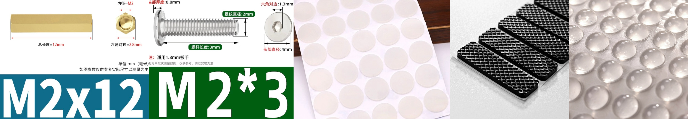

 请仔细阅读指南，也可参考其他分割键盘构造指南作为参考 

## PCB

| 物品 | 数量 | 备注 |
|:---|:---|:---|
| PCB | 2 | 如果使用 3D 打印外壳，则用 1.6mm 厚 |
| ProMicro | 2 | [nice!nano](https://nicekeyboards.com/nice-nano) |
| 二极管 | 46 | SOD-123 或 DO-35 |
| 重置开关 | 2 | 3\*6\*5 |
| 电池开关 | 2 | MSK-1102-1.5H |
| 电池插座 | 2 | PH2.0 2P |
| 电池 | 2 | 3.7V 锂电池（最大 40\*50\*70） |
| PCB 轴座 | 46 | 兼容标准轴和佳达隆矮轴，如使用 choc 版本 PCB 则兼容凯华矮轴 |
| 轴体 | 46 | 按照你选择的轴座选择对应轴体 |
| 键帽 | 46 | 1u 键帽 |



## 可选

### RGB 和 Oled

| 物品 | 数量 | 备注 |
|:---|:---|:---|
| OLED | 2 | 0.91 英寸 |
| SK6812MINI-E | 58 | 因为它们是串连的，所以需要全部安装 |



### 外壳

#### 标准外壳

| 物品 | 数量 | 备注 |
|:---|:---|:---|
| M2 螺柱 12mm | 4 | 用于垫高 OLED 盖板 |
| M2 螺丝 | 24 | 至少 3mm |
| 脚垫 | 任意 | 防滑 |

#### 透明外壳

| 物品 | 数量 | 备注 |
|:---|:---|:---|
| 定位板 | 2 | 1.5mm-4mm |
| 底板 | 2 | 至少 1.5mm |
| OLED 盖板 | 2 | 至少 1mm |
| M2 螺柱 7mm | 10 | 放于 PCB 和底板之间 |

#### 3D 打印外壳

| 物品 | 数量 | 备注 |
|:---|:---|:---|
| M2 螺柱 7+4mm | 10 | 放于 PCB 和底板之间 |
| 热熔螺母 M2\*3\*3.5 | 10 | 用烙铁熔入外壳 |
| 3D 打印外壳 | 2 | 随意选择打印材料 |
| OLED 盖板 | 2 | 2mm |
| 底板 | 2 | 2mm |

