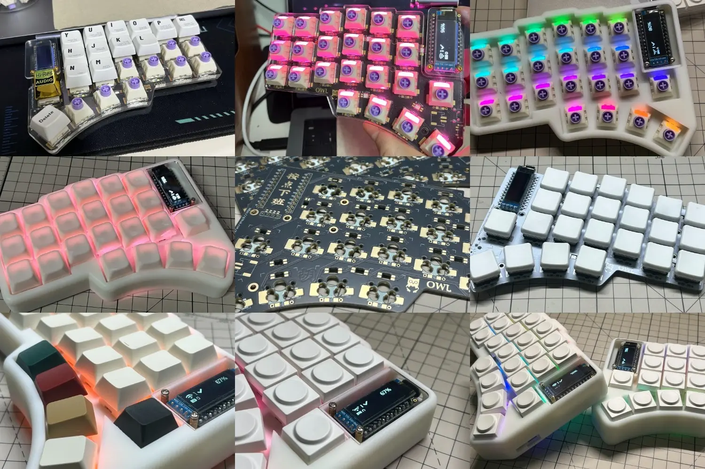
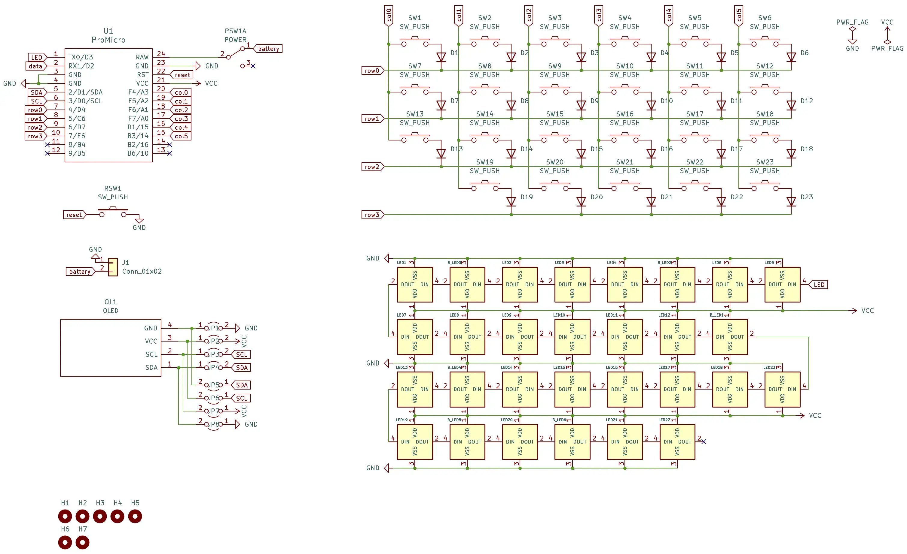


**Owl (Orthogonal Wireless Layout)**



Combines the ergonomic freedom of wireless connectivity with a split keyboard


> Design influenced by [Lily58](https://github.com/kata0510/Lily58), [Corne](https://github.com/foostan/crkbd), [Sofle](https://github.com/josefadamcik/SofleKeyboard) and [Torn](https://github.com/rtitmuss/torn) keyboards

## Feature

- **Owl** uses **Pro Micro** Interconnect small controller board, which means easy for Maintenance and replacemen. And supports a variety of boards including [nice!nano](https://nicekeyboards.com/nice-nano) and [nrfmicro](https://github.com/joric/nrfmicro/) (I **have not tried yet**, but theoretically feasible).
- Low latency wireless, supported by [ZMK](https://github.com/zmkfirmware/zmk).
- Gorgeous **RGB** lighting effects.
- **Two** multifunctional **OLED** screens that can display keyboard battery level and connection status.
- Split keyboard conforms to **ergonomics**.
- A total of **two** PCBs compatible with Cherry MX switches, Kailh choc Low Profile switches, and Gateron Low Profile switches.
- **Double-sided** PCB design, both sides are universal.

## DIY

Please make sure you can get the ability to build the keyboard:
- Soldering circuit components
- Circuit board production
- 3D printing
- Using GitHub action to build firmware
- Consulting documents carefully

 Continue reading the **Owl Split Keyboard** series to make a keyboard 

## License

The Owl Keyboard is licensed under [Creative Commons Attribution-NonCommercial 4.0 International License](https://creativecommons.org/licenses/by-nc/4.0).

This PCB design may be freely reproduced, modified, and manufactured for personal use only. If you would like to use this design commercially please contact me at hza2002@foxmail.com to request permission.
