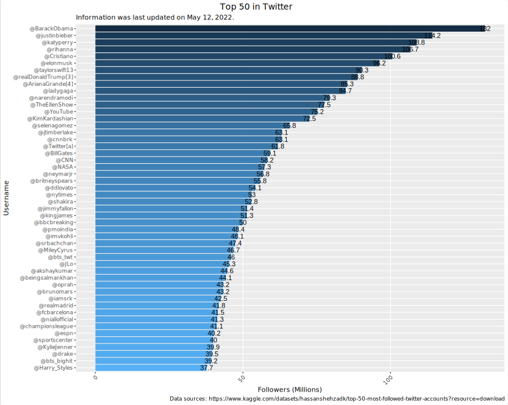
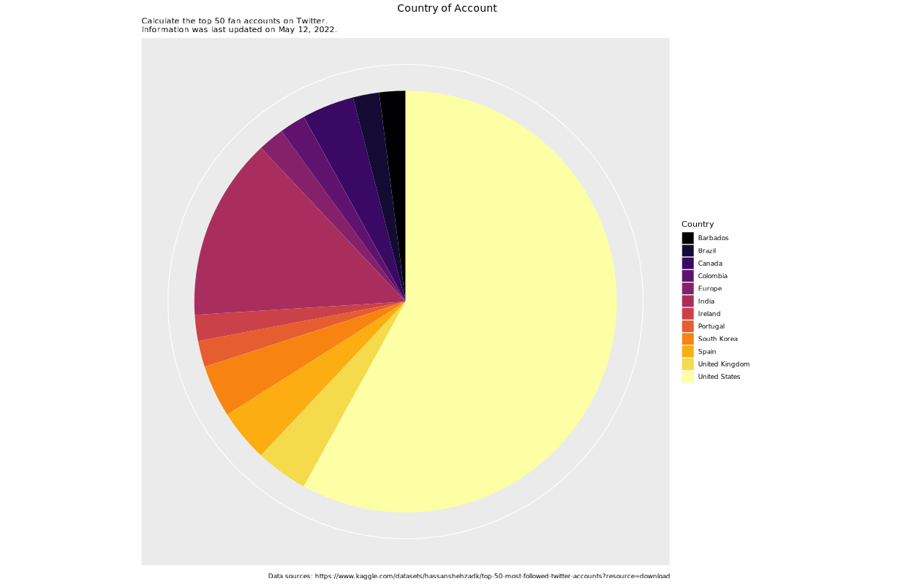

> Data source: [Top 50 Most Followed Twitter Accounts](https://www.kaggle.com/datasets/hassanshehzadk/top-50-most-followed-twitter-accounts?resource=download)

## Introduction

The data lists the top 50 most-followed accounts on **Twitter**, with each total rounded to the nearest hundred thousand, as well as the profession or activity of each user. Account totals and monthly changes in the ranking were last updated on **May 12, 2022**.

## Fan leaderboard

> We try to use this data set to make intuitive charts of the top 50 accounts of Twitter fans.

### Import

The first step is import the raw data to the program code.

```R
data_csv <- read.csv("Top 50 Most Followed Twitter Accounts.csv")
```

### Visualize

- Due to the non-repeatable nature of the Twitter account id, we naturally chose the user ID as the y-axis data.
- We reorder the accounts with the number of fans and display them on the image from more to less.
- In order to make the image comparison more intuitive, we creatively use the number of fans to draw gradient colors, from deep to light represents the number of fans from more to less .

```R
dataplot <- data_csv %>%
  ggplot(mapping = aes(
    x = Followers..millions.,
    y = reorder(Account.username, Followers..millions.),
    fill = -log(Followers..millions.),
  )) +
  geom_bar(
    stat = "identity",
  ) +
  guides(fill = "none") +
  geom_text(mapping = aes(
    label = Followers..millions.,
  ))

# Add auxiliary information.
dataplot +
  labs(
    x = "Followers (Millions)",
    y = "Username",
    title = "Top 50 in Twitter",
    subtitle = "Information was last updated on May 12, 2022.",
    caption = "Data sources: https://www.kaggle.com/datasets/hassanshehzadk/top-50-most-followed-twitter-accounts?resource=download",
  ) +
  theme(
    plot.title = element_text(hjust = 0.4, size = 14), # title position
    panel.grid.minor = element_blank(), # Secondary grid lines
    text = element_text(family = "Hack Nerd Font"), # font
    axis.text.x = element_text(angle = 45, vjust = 1, hjust = 1)
  )
```



{}
```R
library(tidyverse)
library(ggplot2)

# Import
data_csv <- read.csv("Top 50 Most Followed Twitter Accounts.csv")

# Plot
dataplot <- data_csv %>%
  ggplot(mapping = aes(
    x = Followers..millions.,
    y = reorder(Account.username, Followers..millions.),
    fill = -log(Followers..millions.),
  )) +
  geom_bar(
    stat = "identity",
  ) +
  guides(fill = "none") +
  geom_text(mapping = aes(
    label = Followers..millions.,
  ))

# Add auxiliary information.
dataplot +
  labs(
    x = "Followers (Millions)",
    y = "Username",
    title = "Top 50 in Twitter",
    subtitle = "Information was last updated on May 12, 2022.",
    caption = "Data sources: https://www.kaggle.com/datasets/hassanshehzadk/top-50-most-followed-twitter-accounts?resource=download", # nolint
  ) +
  theme(
    plot.title = element_text(hjust = 0.4, size = 14), # title position
    panel.grid.minor = element_blank(), # Secondary grid lines
    text = element_text(family = "Hack Nerd Font"), # font
    axis.text.x = element_text(angle = 45, vjust = 1, hjust = 1)
  )
```
{}

## Account attribution analysis

> We also want to see which countries the accounts with a large number of fans come from, so we want to draw a pie chart to check their distribution.

### Import

The first step is import the raw data to the program code.

```R
data_csv <- read.csv("Top 50 Most Followed Twitter Accounts.csv")
```

### Selection

We quickly count the frequency of each country in the data set.

```R
area_count <- data_csv %>%
  count(Country, name = "count")
```

### Visualize

- Since there is no built-in pie chart drawing method in `ggplot`, we use `geom_bar` and `coord_polar` to try to achieve the same effect.

```R
dataplot <- area_count %>%
  ggplot(mapping = aes(
    x = 1,
    y = count,
    fill = Country,
  ))

dataplot +
  geom_bar(stat = "identity") +
  coord_polar(theta = "y") +
  scale_x_continuous(name = NULL, breaks = NULL) +
  scale_y_continuous(name = NULL, breaks = NULL) +
  scale_fill_viridis_d(option = "inferno")
```



### Conclusions of the study

1. Obviously, as a native national software of the United States, and considering the large population base of the United States, the number of countries whose accounts belong to the United States far exceeds others.
2. India, as a populous country, unexpectedly became the second place after the United States.
3. The number of other countries is basically the same.

{}
```R
library(tidyverse)
library(ggplot2)

data_csv <- read.csv("Top 50 Most Followed Twitter Accounts.csv")

area_count <- data_csv %>%
  count(Country, name = "count")

dataplot <- area_count %>%
  ggplot(mapping = aes(
    x = 1,
    y = count,
    fill = Country,
  ))

dataplot +
  geom_bar(stat = "identity") +
  coord_polar(theta = "y") +
  scale_x_continuous(name = NULL, breaks = NULL) +
  scale_y_continuous(name = NULL, breaks = NULL) +
  scale_fill_viridis_d(option = "inferno") +
  labs(
    x = "Followers (Millions)",
    y = "Username",
    fill = "Country",
    title = "Country of Account",
    subtitle = "Calculate the top 50 fan accounts on Twitter.\nInformation was last updated on May 12, 2022.", # nolint
    caption = "Data sources: https://www.kaggle.com/datasets/hassanshehzadk/top-50-most-followed-twitter-accounts?resource=download", # nolint
  ) +
  theme(
    plot.title = element_text(hjust = 0.6, size = 14), # title position
    axis.text.x = element_text(angle = 45, vjust = 1, hjust = 1),
    plot.caption = element_text(hjust = 0.3),
  )
```
{}